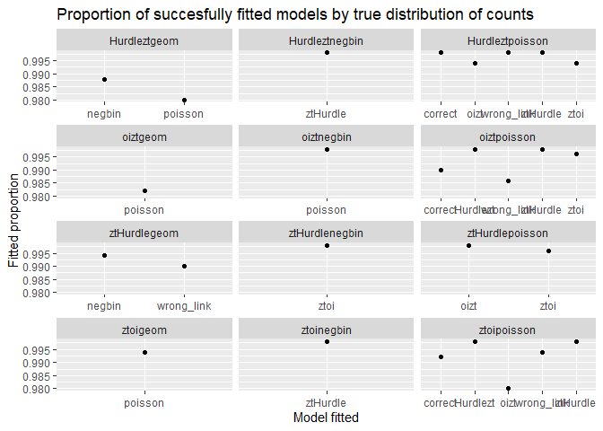
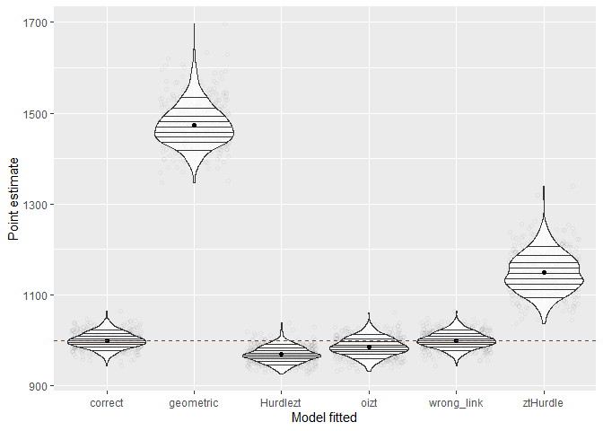
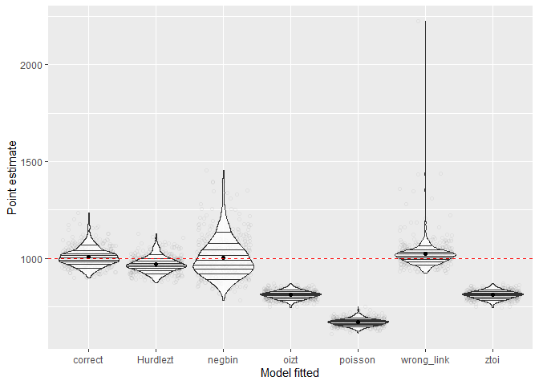
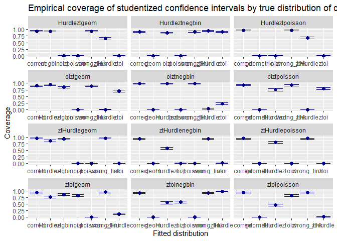
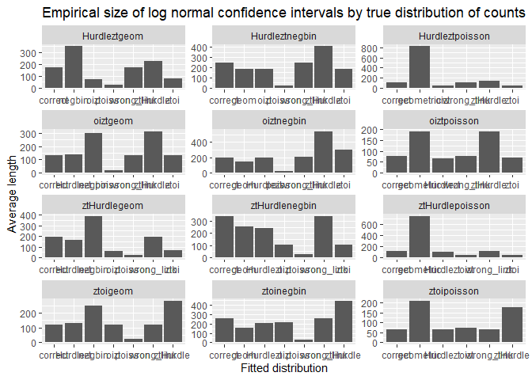

General results:


```r
summarised_df <- results_data_frame |> 
  group_by(data_generation, data_fitted) |> 
  summarise(mean_point              = mean(point, na.rm = TRUE),
            mean_ci_length_norm     = mean(conf_int_normal_upper - conf_int_normal_lower, na.rm = TRUE),
            coverage_ci_norm        = mean((conf_int_normal_lower < 1000) & (1000 < conf_int_normal_upper), na.rm = TRUE),
            mean_ci_length_log_norm = mean(conf_int_log_normal_upper - conf_int_log_normal_lower, na.rm = TRUE),
            coverage_ci_log_norm    = mean((conf_int_log_normal_lower < 1000) & (1000 < conf_int_log_normal_upper), na.rm = TRUE),
            succesful_fits          = mean(!is.na(point)))
```

```
## `summarise()` has grouped output by 'data_generation'. You can override using
## the `.groups` argument.
```

```r
print(summarised_df, n=20)
```

```
## # A tibble: 80 × 8
## # Groups:   data_generation [12]
##    data_generation data_fitted mean_point mean_ci_length_norm coverage_ci_norm
##    <chr>           <chr>            <dbl>               <dbl>            <dbl>
##  1 Hurdleztgeom    correct          1008.               168.             0.938
##  2 Hurdleztgeom    negbin           1003.               340.             0.927
##  3 Hurdleztgeom    oizt              873.                69.7            0    
##  4 Hurdleztgeom    poisson           700.                24.1            0    
##  5 Hurdleztgeom    wrong_link       1008.               168.             0.938
##  6 Hurdleztgeom    ztHurdle         1094.               220.             0.654
##  7 Hurdleztgeom    ztoi              874.                78.9            0    
##  8 Hurdleztnegbin  correct           999.               236.             0.914
##  9 Hurdleztnegbin  geom             1188.               181.             0.004
## 10 Hurdleztnegbin  oizt              990.               181.             0.864
## 11 Hurdleztnegbin  poisson           816.                22.2            0    
## 12 Hurdleztnegbin  wrong_link        999.               237.             0.918
## 13 Hurdleztnegbin  ztHurdle     23285419.          56970543.             0.934
## 14 Hurdleztnegbin  ztoi            64086.             34427.             0.908
## 15 Hurdleztpoisson correct          1002.               104.             0.964
## 16 Hurdleztpoisson geometric        2279.               820.             0    
## 17 Hurdleztpoisson oizt              908.                42.5            0    
## 18 Hurdleztpoisson wrong_link       1003.               103.             0.962
## 19 Hurdleztpoisson ztHurdle         1057.               140.             0.687
## 20 Hurdleztpoisson ztoi              908.                42.5            0    
## # ℹ 60 more rows
## # ℹ 3 more variables: mean_ci_length_log_norm <dbl>,
## #   coverage_ci_log_norm <dbl>, succesful_fits <dbl>
```

```r
pp <- summarised_df |>
  subset(succesful_fits < 1) |>
  as.data.frame() |> 
  mutate(data_generation = ordered(data_generation)) |>
  ggplot(aes(y = succesful_fits, x = data_fitted)) +
  geom_point() +
  facet_wrap(~data_generation, scales = c("free_x"), ncol = 3) + 
  ylab("Fitted proportion") +
  xlab("Model fitted") +
  ggtitle("Proportion of succesfully fitted models by true distribution of counts")

pp
```



Visualising outliers (i.e. when estimated regression parameters tend to boundary):


```r
outliers <- results_data_frame |>
  subset(!is.na(point)) |>
  subset(point > 5000) |> 
  group_by(data_generation, data_fitted) |>
  summarise(n = n()) |>
  ggplot(aes(x = data_fitted, weight = n)) +
  geom_bar() +
  facet_wrap(~ data_generation, scales = c("free_x")) + 
  ylab("Number of outliers") +
  xlab("Model fitted") +
  ggtitle("Exreme outliers (estimate > 5 * true size) by true distribution of counts")
```

```
## `summarise()` has grouped output by 'data_generation'. You can override using
## the `.groups` argument.
```

```r
outliers
```


## Point estimates

Results for counts generated by ztoipoisson:


```r
p1 <- results_data_frame |>
  subset(!is.na(point) & (data_generation == "ztoipoisson")) |>
  subset(point < 5000) |>
  ggplot(aes(x = data_fitted, y = point)) +
  geom_jitter(alpha = 0.05, shape = 1) + 
  geom_violin(alpha = 0.8, draw_quantiles = 1:9 / 10, scale = "width") +
  stat_summary(fun = function(x) mean(x, na.rm = TRUE), geom = "point") + 
  geom_hline(yintercept = 1000, linetype="dashed", color = "red") +
  ylab("Point estimate") +
  xlab("Model fitted")

p1
```



Summary statistics after excluding outliers:

```r
results_data_frame |>
  subset(!is.na(point) & (data_generation == "ztoipoisson")) |>
  subset(point < 5000) |>
  group_by(data_fitted) |>
  summarise(bias = mean(point - 1000),
            rel_bias = mean(point - 1000) / 1000,
            MSE = mean((point - 1000)^2),
            MAE = mean(abs(point - 1000)),
            coverage_normal = mean((conf_int_normal_lower < 1000) & (conf_int_normal_upper > 1000)),
            coverage_log_normal = mean((conf_int_log_normal_lower < 1000) & (conf_int_log_normal_upper > 1000)))
```

<div data-pagedtable="false">
  <script data-pagedtable-source type="application/json">
{"columns":[{"label":["data_fitted"],"name":[1],"type":["chr"],"align":["left"]},{"label":["bias"],"name":[2],"type":["dbl"],"align":["right"]},{"label":["rel_bias"],"name":[3],"type":["dbl"],"align":["right"]},{"label":["MSE"],"name":[4],"type":["dbl"],"align":["right"]},{"label":["MAE"],"name":[5],"type":["dbl"],"align":["right"]},{"label":["coverage_normal"],"name":[6],"type":["dbl"],"align":["right"]},{"label":["coverage_log_normal"],"name":[7],"type":["dbl"],"align":["right"]}],"data":[{"1":"Hurdlezt","2":"-31.485706006","3":"-3.148571e-02","4":"1292.0464","5":"32.20100","6":"0.46492986","7":"0.599198397"},{"1":"correct","2":"-0.040245985","3":"-4.024598e-05","4":"308.9122","5":"13.89747","6":"0.93750000","7":"0.937500000"},{"1":"geometric","2":"473.931490520","3":"4.739315e-01","4":"226792.4258","5":"473.93149","6":"0.00000000","7":"0.000000000"},{"1":"oizt","2":"-14.390596466","3":"-1.439060e-02","4":"616.6304","5":"20.30087","6":"0.82857143","7":"0.875510204"},{"1":"wrong_link","2":"-0.004118202","3":"-4.118202e-06","4":"306.5886","5":"13.84847","6":"0.93963783","7":"0.939637827"},{"1":"ztHurdle","2":"149.076711721","3":"1.490767e-01","4":"24082.4965","5":"149.07671","6":"0.01803607","7":"0.008016032"}],"options":{"columns":{"min":{},"max":[10]},"rows":{"min":[10],"max":[10]},"pages":{}}}
  </script>
</div>

Results for counts generated by oiztpoisson:


```r
p2 <- results_data_frame |>
  subset(!is.na(point) & (data_generation == "oiztpoisson")) |>
  subset(point < 5000) |>
  ggplot(aes(x = data_fitted, y = point)) +
  geom_jitter(alpha = 0.05, shape = 1) + 
  geom_violin(alpha = 0.8, draw_quantiles = 1:9 / 10, scale = "width") +
  stat_summary(fun = function(x) mean(x, na.rm = TRUE), geom = "point") + 
  geom_hline(yintercept = 1000, linetype="dashed", color = "red") +
  ylab("Point estimate") +
  xlab("Model fitted")

p2
```


Summary statistics after excluding outliers:

```r
results_data_frame |>
  subset(!is.na(point) & (data_generation == "oiztpoisson")) |>
  subset(point < 5000) |>
  group_by(data_fitted) |>
  summarise(bias = mean(point - 1000),
            rel_bias = mean(point - 1000) / 1000,
            MSE = mean((point - 1000)^2),
            MAE = mean(abs(point - 1000)),
            coverage_normal = mean((conf_int_normal_lower < 1000) & (conf_int_normal_upper > 1000)),
            coverage_log_normal = mean((conf_int_log_normal_lower < 1000) & (conf_int_log_normal_upper > 1000)))
```

<div data-pagedtable="false">
  <script data-pagedtable-source type="application/json">
{"columns":[{"label":["data_fitted"],"name":[1],"type":["chr"],"align":["left"]},{"label":["bias"],"name":[2],"type":["dbl"],"align":["right"]},{"label":["rel_bias"],"name":[3],"type":["dbl"],"align":["right"]},{"label":["MSE"],"name":[4],"type":["dbl"],"align":["right"]},{"label":["MAE"],"name":[5],"type":["dbl"],"align":["right"]},{"label":["coverage_normal"],"name":[6],"type":["dbl"],"align":["right"]},{"label":["coverage_log_normal"],"name":[7],"type":["dbl"],"align":["right"]}],"data":[{"1":"Hurdlezt","2":"-17.2475428","3":"-0.0172475428","4":"593.0977","5":"19.99387","6":"0.7535070","7":"0.8356713"},{"1":"correct","2":"0.3820967","3":"0.0003820967","4":"439.3124","5":"17.20785","6":"0.9313131","7":"0.9292929"},{"1":"geometric","2":"518.0758772","3":"0.5180758772","4":"270343.7973","5":"518.07588","6":"0.0000000","7":"0.0000000"},{"1":"wrong_link","2":"0.4506646","3":"0.0004506646","4":"430.5660","5":"16.93210","6":"0.9229209","7":"0.9269777"},{"1":"ztHurdle","2":"185.1272248","3":"0.1851272248","4":"36263.3612","5":"185.12722","6":"0.0000000","7":"0.0000000"},{"1":"ztoi","2":"21.0314994","3":"0.0210314994","4":"744.7463","5":"22.69091","6":"0.8072289","7":"0.7168675"}],"options":{"columns":{"min":{},"max":[10]},"rows":{"min":[10],"max":[10]},"pages":{}}}
  </script>
</div>

Results for counts generated by ztHurdlepoisson:


```r
p3 <- results_data_frame |>
  subset(!is.na(point) & (data_generation == "ztHurdlepoisson")) |>
  subset(point < 5000) |>
  ggplot(aes(x = data_fitted, y = point)) +
  geom_jitter(alpha = 0.05, shape = 1) + 
  geom_violin(alpha = 0.8, draw_quantiles = 1:9 / 10, scale = "width") +
  stat_summary(fun = function(x) mean(x, na.rm = TRUE), geom = "point") + 
  geom_hline(yintercept = 1000, linetype="dashed", color = "red") +
  ylab("Point estimate") +
  xlab("Model fitted")

p3
```


Summary statistics after excluding outliers:

```r
results_data_frame |>
  subset(!is.na(point) & (data_generation == "ztHurdlepoisson")) |>
  subset(point < 5000) |>
  group_by(data_fitted) |>
  summarise(bias = mean(point - 1000),
            rel_bias = mean(point - 1000) / 1000,
            MSE = mean((point - 1000)^2),
            MAE = mean(abs(point - 1000)),
            coverage_normal = mean((conf_int_normal_lower < 1000) & (conf_int_normal_upper > 1000)),
            coverage_log_normal = mean((conf_int_log_normal_lower < 1000) & (conf_int_log_normal_upper > 1000)))
```

<div data-pagedtable="false">
  <script data-pagedtable-source type="application/json">
{"columns":[{"label":["data_fitted"],"name":[1],"type":["chr"],"align":["left"]},{"label":["bias"],"name":[2],"type":["dbl"],"align":["right"]},{"label":["rel_bias"],"name":[3],"type":["dbl"],"align":["right"]},{"label":["MSE"],"name":[4],"type":["dbl"],"align":["right"]},{"label":["MAE"],"name":[5],"type":["dbl"],"align":["right"]},{"label":["coverage_normal"],"name":[6],"type":["dbl"],"align":["right"]},{"label":["coverage_log_normal"],"name":[7],"type":["dbl"],"align":["right"]}],"data":[{"1":"Hurdlezt","2":"-21.434221","3":"-0.021434221","4":"1178.4349","5":"27.81447","6":"0.800","7":"0.870"},{"1":"correct","2":"3.875333","3":"0.003875333","4":"955.5044","5":"24.93050","6":"0.946","7":"0.952"},{"1":"geometric","2":"1190.871359","3":"1.190871359","4":"1444967.2854","5":"1190.87136","6":"0.000","7":"0.000"},{"1":"oizt","2":"-121.177992","3":"-0.121177992","4":"14893.7107","5":"121.17799","6":"0.000","7":"0.000"},{"1":"wrong_link","2":"3.875316","3":"0.003875316","4":"955.5042","5":"24.93049","6":"0.946","7":"0.952"},{"1":"ztoi","2":"-120.841779","3":"-0.120841779","4":"14812.4468","5":"120.84178","6":"0.000","7":"0.000"}],"options":{"columns":{"min":{},"max":[10]},"rows":{"min":[10],"max":[10]},"pages":{}}}
  </script>
</div>

Results for counts generated by hurdleztpoisson:


```r
p4 <- results_data_frame |>
  subset(!is.na(point) & (data_generation == "Hurdleztpoisson")) |>
  subset(point < 5000) |>
  ggplot(aes(x = data_fitted, y = point)) +
  geom_jitter(alpha = 0.05, shape = 1) + 
  geom_violin(alpha = 0.8, draw_quantiles = 1:9 / 10, scale = "width") +
  stat_summary(fun = function(x) mean(x, na.rm = TRUE), geom = "point") + 
  geom_hline(yintercept = 1000, linetype="dashed", color = "red") +
  ylab("Point estimate") +
  xlab("Model fitted")

p4
```


Summary statistics after excluding outliers:

```r
results_data_frame |>
  subset(!is.na(point) & (data_generation == "Hurdleztpoisson")) |>
  subset(point < 5000) |>
  group_by(data_fitted) |>
  summarise(bias = mean(point - 1000),
            rel_bias = mean(point - 1000) / 1000,
            MSE = mean((point - 1000)^2),
            MAE = mean(abs(point - 1000)),
            coverage_normal = mean((conf_int_normal_lower < 1000) & (conf_int_normal_upper > 1000)),
            coverage_log_normal = mean((conf_int_log_normal_lower < 1000) & (conf_int_log_normal_upper > 1000)))
```

<div data-pagedtable="false">
  <script data-pagedtable-source type="application/json">
{"columns":[{"label":["data_fitted"],"name":[1],"type":["chr"],"align":["left"]},{"label":["bias"],"name":[2],"type":["dbl"],"align":["right"]},{"label":["rel_bias"],"name":[3],"type":["dbl"],"align":["right"]},{"label":["MSE"],"name":[4],"type":["dbl"],"align":["right"]},{"label":["MAE"],"name":[5],"type":["dbl"],"align":["right"]},{"label":["coverage_normal"],"name":[6],"type":["dbl"],"align":["right"]},{"label":["coverage_log_normal"],"name":[7],"type":["dbl"],"align":["right"]}],"data":[{"1":"correct","2":"2.056661","3":"0.002056661","4":"648.0532","5":"20.07331","6":"0.9639279","7":"0.9579158"},{"1":"geometric","2":"1279.176174","3":"1.279176174","4":"1668109.1459","5":"1279.17617","6":"0.0000000","7":"0.0000000"},{"1":"oizt","2":"-92.241605","3":"-0.092241605","4":"8684.2277","5":"92.24161","6":"0.0000000","7":"0.0000000"},{"1":"wrong_link","2":"2.585257","3":"0.002585257","4":"646.5763","5":"20.03141","6":"0.9619238","7":"0.9539078"},{"1":"ztHurdle","2":"57.414333","3":"0.057414333","4":"4489.9187","5":"58.26944","6":"0.6873747","7":"0.5531062"},{"1":"ztoi","2":"-91.759578","3":"-0.091759578","4":"8593.7841","5":"91.75958","6":"0.0000000","7":"0.0000000"}],"options":{"columns":{"min":{},"max":[10]},"rows":{"min":[10],"max":[10]},"pages":{}}}
  </script>
</div>

Results for counts generated by ztoigeom:


```r
p5 <- results_data_frame |>
  subset(!is.na(point) & (data_generation == "ztoigeom")) |>
  subset(point < 5000) |>
  ggplot(aes(x = data_fitted, y = point)) +
  geom_jitter(alpha = 0.05, shape = 1) + 
  geom_violin(alpha = 0.8, draw_quantiles = 1:9 / 10, scale = "width") +
  stat_summary(fun = function(x) mean(x, na.rm = TRUE), geom = "point") + 
  geom_hline(yintercept = 1000, linetype="dashed", color = "red") +
  ylab("Point estimate") +
  xlab("Model fitted")

p5
```


Summary statistics after excluding outliers:

```r
results_data_frame |>
  subset(!is.na(point) & (data_generation == "ztoigeom")) |>
  subset(point < 5000) |>
  group_by(data_fitted) |>
  summarise(bias = mean(point - 1000),
            rel_bias = mean(point - 1000) / 1000,
            MSE = mean((point - 1000)^2),
            MAE = mean(abs(point - 1000)),
            coverage_normal = mean((conf_int_normal_lower < 1000) & (conf_int_normal_upper > 1000)),
            coverage_log_normal = mean((conf_int_log_normal_lower < 1000) & (conf_int_log_normal_upper > 1000)))
```

<div data-pagedtable="false">
  <script data-pagedtable-source type="application/json">
{"columns":[{"label":["data_fitted"],"name":[1],"type":["chr"],"align":["left"]},{"label":["bias"],"name":[2],"type":["dbl"],"align":["right"]},{"label":["rel_bias"],"name":[3],"type":["dbl"],"align":["right"]},{"label":["MSE"],"name":[4],"type":["dbl"],"align":["right"]},{"label":["MAE"],"name":[5],"type":["dbl"],"align":["right"]},{"label":["coverage_normal"],"name":[6],"type":["dbl"],"align":["right"]},{"label":["coverage_log_normal"],"name":[7],"type":["dbl"],"align":["right"]}],"data":[{"1":"Hurdlezt","2":"-34.830188","3":"-0.034830188","4":"2302.8946","5":"40.16946","6":"0.7740000","7":"0.8220000"},{"1":"correct","2":"4.660937","3":"0.004660937","4":"974.7215","5":"24.83700","6":"0.9480000","7":"0.9360000"},{"1":"negbin","2":"13.608134","3":"0.013608134","4":"6979.7955","5":"59.93748","6":"0.8681818","7":"0.8613636"},{"1":"oizt","2":"-19.256785","3":"-0.019256785","4":"1682.8366","5":"32.80684","6":"0.8300000","7":"0.8560000"},{"1":"poisson","2":"-254.997178","3":"-0.254997178","4":"65316.6411","5":"254.99718","6":"0.0000000","7":"0.0000000"},{"1":"wrong_link","2":"4.653400","3":"0.004653400","4":"983.2236","5":"24.99428","6":"0.9500000","7":"0.9340000"},{"1":"ztHurdle","2":"200.201014","3":"0.200201014","4":"46337.8506","5":"200.30643","6":"0.1300000","7":"0.0680000"}],"options":{"columns":{"min":{},"max":[10]},"rows":{"min":[10],"max":[10]},"pages":{}}}
  </script>
</div>

Results for counts generated by oiztgeom:


```r
p6 <- results_data_frame |>
  subset(!is.na(point) & (data_generation == "oiztgeom")) |>
  subset(point < 5000) |>
  ggplot(aes(x = data_fitted, y = point)) +
  geom_jitter(alpha = 0.05, shape = 1) + 
  geom_violin(alpha = 0.8, draw_quantiles = 1:9 / 10, scale = "width") +
  stat_summary(fun = function(x) mean(x, na.rm = TRUE), geom = "point") + 
  geom_hline(yintercept = 1000, linetype="dashed", color = "red") +
  ylab("Point estimate") +
  xlab("Model fitted")

p6
```


Summary statistics after excluding outliers:

```r
results_data_frame |>
  subset(!is.na(point) & (data_generation == "oiztgeom")) |>
  subset(point < 5000) |>
  group_by(data_fitted) |>
  summarise(bias = mean(point - 1000),
            rel_bias = mean(point - 1000) / 1000,
            MSE = mean((point - 1000)^2),
            MAE = mean(abs(point - 1000)),
            coverage_normal = mean((conf_int_normal_lower < 1000) & (conf_int_normal_upper > 1000)),
            coverage_log_normal = mean((conf_int_log_normal_lower < 1000) & (conf_int_log_normal_upper > 1000)))
```

<div data-pagedtable="false">
  <script data-pagedtable-source type="application/json">
{"columns":[{"label":["data_fitted"],"name":[1],"type":["chr"],"align":["left"]},{"label":["bias"],"name":[2],"type":["dbl"],"align":["right"]},{"label":["rel_bias"],"name":[3],"type":["dbl"],"align":["right"]},{"label":["MSE"],"name":[4],"type":["dbl"],"align":["right"]},{"label":["MAE"],"name":[5],"type":["dbl"],"align":["right"]},{"label":["coverage_normal"],"name":[6],"type":["dbl"],"align":["right"]},{"label":["coverage_log_normal"],"name":[7],"type":["dbl"],"align":["right"]}],"data":[{"1":"Hurdlezt","2":"-5.333763","3":"-0.005333763","4":"1132.512","5":"26.79665","6":"0.9460000","7":"0.9520000"},{"1":"correct","2":"10.397648","3":"0.010397648","4":"1674.674","5":"31.38902","6":"0.9100000","7":"0.8920000"},{"1":"negbin","2":"26.364806","3":"0.026364806","4":"43965.673","5":"80.50390","6":"0.8502024","7":"0.8441296"},{"1":"poisson","2":"-238.106558","3":"-0.238106558","4":"56942.988","5":"238.10656","6":"0.0000000","7":"0.0000000"},{"1":"wrong_link","2":"10.471602","3":"0.010471602","4":"1684.620","5":"31.42043","6":"0.9000000","7":"0.8900000"},{"1":"ztHurdle","2":"277.582804","3":"0.277582804","4":"85605.512","5":"277.58280","6":"0.0040000","7":"0.0040000"},{"1":"ztoi","2":"52.718715","3":"0.052718715","4":"3855.574","5":"53.47865","6":"0.7020000","7":"0.6080000"}],"options":{"columns":{"min":{},"max":[10]},"rows":{"min":[10],"max":[10]},"pages":{}}}
  </script>
</div>

Results for counts generated by ztHurdlegeom:


```r
p7 <- results_data_frame |>
  subset(!is.na(point) & (data_generation == "ztHurdlegeom")) |>
  subset(point < 5000) |>
  ggplot(aes(x = data_fitted, y = point)) +
  geom_jitter(alpha = 0.05, shape = 1) + 
  geom_violin(alpha = 0.8, draw_quantiles = 1:9 / 10, scale = "width") +
  stat_summary(fun = function(x) mean(x, na.rm = TRUE), geom = "point") + 
  geom_hline(yintercept = 1000, linetype="dashed", color = "red") +
  ylab("Point estimate") +
  xlab("Model fitted")

p7
```



Summary statistics after excluding outliers:

```r
results_data_frame |>
  subset(!is.na(point) & (data_generation == "ztHurdlegeom")) |>
  subset(point < 5000) |>
  group_by(data_fitted) |>
  summarise(bias = mean(point - 1000),
            rel_bias = mean(point - 1000) / 1000,
            MSE = mean((point - 1000)^2),
            MAE = mean(abs(point - 1000)),
            coverage_normal = mean((conf_int_normal_lower < 1000) & (conf_int_normal_upper > 1000)),
            coverage_log_normal = mean((conf_int_log_normal_lower < 1000) & (conf_int_log_normal_upper > 1000)))
```

<div data-pagedtable="false">
  <script data-pagedtable-source type="application/json">
{"columns":[{"label":["data_fitted"],"name":[1],"type":["chr"],"align":["left"]},{"label":["bias"],"name":[2],"type":["dbl"],"align":["right"]},{"label":["rel_bias"],"name":[3],"type":["dbl"],"align":["right"]},{"label":["MSE"],"name":[4],"type":["dbl"],"align":["right"]},{"label":["MAE"],"name":[5],"type":["dbl"],"align":["right"]},{"label":["coverage_normal"],"name":[6],"type":["dbl"],"align":["right"]},{"label":["coverage_log_normal"],"name":[7],"type":["dbl"],"align":["right"]}],"data":[{"1":"Hurdlezt","2":"-30.892336","3":"-0.030892336","4":"2555.297","5":"42.39591","6":"0.8600000","7":"0.8920000"},{"1":"correct","2":"7.001553","3":"0.007001553","4":"2303.052","5":"35.82369","6":"0.9600000","7":"0.9560000"},{"1":"negbin","2":"5.039568","3":"0.005039568","4":"10385.211","5":"77.19470","6":"0.9320988","7":"0.9382716"},{"1":"oizt","2":"-188.196846","3":"-0.188196846","4":"35837.212","5":"188.19685","6":"0.0000000","7":"0.0000000"},{"1":"poisson","2":"-329.854577","3":"-0.329854577","4":"109148.727","5":"329.85458","6":"0.0000000","7":"0.0000000"},{"1":"wrong_link","2":"22.547814","3":"0.022547814","4":"6544.273","5":"38.34662","6":"0.9616162","7":"0.9575758"},{"1":"ztoi","2":"-188.127152","3":"-0.188127152","4":"35812.257","5":"188.12715","6":"0.0000000","7":"0.0000000"}],"options":{"columns":{"min":{},"max":[10]},"rows":{"min":[10],"max":[10]},"pages":{}}}
  </script>
</div>

Results for counts generated by hurdleztgeom:


```r
p8 <- results_data_frame |>
  subset(!is.na(point) & (data_generation == "Hurdleztgeom")) |>
  subset(point < 5000) |>
  ggplot(aes(x = data_fitted, y = point)) +
  geom_jitter(alpha = 0.05, shape = 1) + 
  geom_violin(alpha = 0.8, draw_quantiles = 1:9 / 10, scale = "width") +
  stat_summary(fun = function(x) mean(x, na.rm = TRUE), geom = "point") + 
  geom_hline(yintercept = 1000, linetype="dashed", color = "red") +
  ylab("Point estimate") +
  xlab("Model fitted")

p8
```


Summary statistics after excluding outliers:

```r
results_data_frame |>
  subset(!is.na(point) & (data_generation == "Hurdleztgeom")) |>
  subset(point < 5000) |>
  group_by(data_fitted) |>
  summarise(bias = mean(point - 1000),
            rel_bias = mean(point - 1000) / 1000,
            MSE = mean((point - 1000)^2),
            MAE = mean(abs(point - 1000)),
            coverage_normal = mean((conf_int_normal_lower < 1000) & (conf_int_normal_upper > 1000)),
            coverage_log_normal = mean((conf_int_log_normal_lower < 1000) & (conf_int_log_normal_upper > 1000)))
```

<div data-pagedtable="false">
  <script data-pagedtable-source type="application/json">
{"columns":[{"label":["data_fitted"],"name":[1],"type":["chr"],"align":["left"]},{"label":["bias"],"name":[2],"type":["dbl"],"align":["right"]},{"label":["rel_bias"],"name":[3],"type":["dbl"],"align":["right"]},{"label":["MSE"],"name":[4],"type":["dbl"],"align":["right"]},{"label":["MAE"],"name":[5],"type":["dbl"],"align":["right"]},{"label":["coverage_normal"],"name":[6],"type":["dbl"],"align":["right"]},{"label":["coverage_log_normal"],"name":[7],"type":["dbl"],"align":["right"]}],"data":[{"1":"correct","2":"8.438832","3":"0.008438832","4":"1931.354","5":"34.70227","6":"0.9380000","7":"0.9440000"},{"1":"negbin","2":"3.361626","3":"0.003361626","4":"7995.415","5":"68.87675","6":"0.9271255","7":"0.9595142"},{"1":"oizt","2":"-127.482378","3":"-0.127482378","4":"16755.200","5":"127.48238","6":"0.0000000","7":"0.0000000"},{"1":"poisson","2":"-299.994619","3":"-0.299994619","4":"90320.415","5":"299.99462","6":"0.0000000","7":"0.0000000"},{"1":"wrong_link","2":"8.437679","3":"0.008437679","4":"1938.236","5":"34.76288","6":"0.9380000","7":"0.9440000"},{"1":"ztHurdle","2":"94.076059","3":"0.094076059","4":"12496.409","5":"95.75605","6":"0.6540000","7":"0.5420000"},{"1":"ztoi","2":"-126.037147","3":"-0.126037147","4":"16378.694","5":"126.03715","6":"0.0000000","7":"0.0000000"}],"options":{"columns":{"min":{},"max":[10]},"rows":{"min":[10],"max":[10]},"pages":{}}}
  </script>
</div>

Results for counts generated by ztoinegbin:


```r
p9 <- results_data_frame |>
  subset(!is.na(point) & (data_generation == "ztoinegbin")) |>
  subset(point < 5000) |>
  ggplot(aes(x = data_fitted, y = point)) +
  geom_jitter(alpha = 0.05, shape = 1) + 
  geom_violin(alpha = 0.8, draw_quantiles = 1:9 / 10, scale = "width") +
  stat_summary(fun = function(x) mean(x, na.rm = TRUE), geom = "point") + 
  geom_hline(yintercept = 1000, linetype="dashed", color = "red") +
  ylab("Point estimate") +
  xlab("Model fitted")

p9
```


Summary statistics after excluding outliers:

```r
results_data_frame |>
  subset(!is.na(point) & (data_generation == "ztoinegbin")) |>
  subset(point < 5000) |>
  group_by(data_fitted) |>
  summarise(bias = mean(point - 1000),
            rel_bias = mean(point - 1000) / 1000,
            MSE = mean((point - 1000)^2),
            MAE = mean(abs(point - 1000)),
            coverage_normal = mean((conf_int_normal_lower < 1000) & (conf_int_normal_upper > 1000)),
            coverage_log_normal = mean((conf_int_log_normal_lower < 1000) & (conf_int_log_normal_upper > 1000)))
```

<div data-pagedtable="false">
  <script data-pagedtable-source type="application/json">
{"columns":[{"label":["data_fitted"],"name":[1],"type":["chr"],"align":["left"]},{"label":["bias"],"name":[2],"type":["dbl"],"align":["right"]},{"label":["rel_bias"],"name":[3],"type":["dbl"],"align":["right"]},{"label":["MSE"],"name":[4],"type":["dbl"],"align":["right"]},{"label":["MAE"],"name":[5],"type":["dbl"],"align":["right"]},{"label":["coverage_normal"],"name":[6],"type":["dbl"],"align":["right"]},{"label":["coverage_log_normal"],"name":[7],"type":["dbl"],"align":["right"]}],"data":[{"1":"Hurdlezt","2":"-71.186058","3":"-0.071186058","4":"8058.201","5":"79.74286","6":"0.5500000","7":"0.6820000"},{"1":"correct","2":"7.514432","3":"0.007514432","4":"8752.560","5":"55.56200","6":"0.9208925","7":"0.9452333"},{"1":"geom","2":"175.154635","3":"0.175154635","4":"32022.777","5":"175.15464","6":"0.0000000","7":"0.0000000"},{"1":"oizt","2":"-66.452434","3":"-0.066452434","4":"8089.060","5":"78.36221","6":"0.5800000","7":"0.7020000"},{"1":"poisson","2":"-191.270694","3":"-0.191270694","4":"36846.681","5":"191.27069","6":"0.0000000","7":"0.0000000"},{"1":"wrong_link","2":"5.021387","3":"0.005021387","4":"5245.304","5":"52.61938","6":"0.9251012","7":"0.9514170"},{"1":"ztHurdle","2":"121.735622","3":"0.121735622","4":"27929.212","5":"127.35270","6":"0.9857434","7":"0.7678208"}],"options":{"columns":{"min":{},"max":[10]},"rows":{"min":[10],"max":[10]},"pages":{}}}
  </script>
</div>

Results for counts generated by oiztnegbin:


```r
p10 <- results_data_frame |>
  subset(!is.na(point) & (data_generation == "oiztnegbin")) |>
  subset(point < 5000) |>
  ggplot(aes(x = data_fitted, y = point)) +
  geom_jitter(alpha = 0.05, shape = 1) + 
  geom_violin(alpha = 0.8, draw_quantiles = 1:9 / 10, scale = "width") +
  stat_summary(fun = function(x) mean(x, na.rm = TRUE), geom = "point") + 
  geom_hline(yintercept = 1000, linetype="dashed", color = "red") +
  ylab("Point estimate") +
  xlab("Model fitted")

p10
```


Summary statistics after excluding outliers:

```r
results_data_frame |>
  subset(!is.na(point) & (data_generation == "oiztnegbin")) |>
  subset(point < 5000) |>
  group_by(data_fitted) |>
  summarise(bias = mean(point - 1000),
            rel_bias = mean(point - 1000) / 1000,
            MSE = mean((point - 1000)^2),
            MAE = mean(abs(point - 1000)),
            coverage_normal = mean((conf_int_normal_lower < 1000) & (conf_int_normal_upper > 1000)),
            coverage_log_normal = mean((conf_int_log_normal_lower < 1000) & (conf_int_log_normal_upper > 1000)))
```

<div data-pagedtable="false">
  <script data-pagedtable-source type="application/json">
{"columns":[{"label":["data_fitted"],"name":[1],"type":["chr"],"align":["left"]},{"label":["bias"],"name":[2],"type":["dbl"],"align":["right"]},{"label":["rel_bias"],"name":[3],"type":["dbl"],"align":["right"]},{"label":["MSE"],"name":[4],"type":["dbl"],"align":["right"]},{"label":["MAE"],"name":[5],"type":["dbl"],"align":["right"]},{"label":["coverage_normal"],"name":[6],"type":["dbl"],"align":["right"]},{"label":["coverage_log_normal"],"name":[7],"type":["dbl"],"align":["right"]}],"data":[{"1":"Hurdlezt","2":"44.59132","3":"0.04459132","4":"4400.659","5":"49.76015","6":"0.99000000","7":"0.84400000"},{"1":"correct","2":"45.70484","3":"0.04570484","4":"4533.150","5":"50.66992","6":"0.98600000","7":"0.83200000"},{"1":"geom","2":"187.17061","3":"0.18717061","4":"36203.534","5":"187.17061","6":"0.00000000","7":"0.00000000"},{"1":"poisson","2":"-87.44804","3":"-0.08744804","4":"7759.189","5":"87.44804","6":"0.00000000","7":"0.00000000"},{"1":"wrong_link","2":"47.19503","3":"0.04719503","4":"4827.854","5":"51.98986","6":"0.98800000","7":"0.83200000"},{"1":"ztHurdle","2":"318.60808","3":"0.31860808","4":"119662.624","5":"318.60808","6":"0.03869654","7":"0.00407332"},{"1":"ztoi","2":"165.88765","3":"0.16588765","4":"32981.778","5":"165.88765","6":"0.22874494","7":"0.04655870"}],"options":{"columns":{"min":{},"max":[10]},"rows":{"min":[10],"max":[10]},"pages":{}}}
  </script>
</div>

Results for counts generated by ztHurdlenegbin:


```r
p11 <- results_data_frame |>
  subset(!is.na(point) & (data_generation == "ztHurdlenegbin")) |>
  subset(point < 5000) |>
  ggplot(aes(x = data_fitted, y = point)) +
  geom_jitter(alpha = 0.05, shape = 1) + 
  geom_violin(alpha = 0.8, draw_quantiles = 1:9 / 10, scale = "width") +
  stat_summary(fun = function(x) mean(x, na.rm = TRUE), geom = "point") + 
  geom_hline(yintercept = 1000, linetype="dashed", color = "red") +
  ylab("Point estimate") +
  xlab("Model fitted")

p11
```


Summary statistics after excluding outliers:

```r
results_data_frame |>
  subset(!is.na(point) & (data_generation == "ztHurdlenegbin")) |>
  subset(point < 5000) |>
  group_by(data_fitted) |>
  summarise(bias = mean(point - 1000),
            rel_bias = mean(point - 1000) / 1000,
            MSE = mean((point - 1000)^2),
            MAE = mean(abs(point - 1000)),
            coverage_normal = mean((conf_int_normal_lower < 1000) & (conf_int_normal_upper > 1000)),
            coverage_log_normal = mean((conf_int_log_normal_lower < 1000) & (conf_int_log_normal_upper > 1000)))
```

<div data-pagedtable="false">
  <script data-pagedtable-source type="application/json">
{"columns":[{"label":["data_fitted"],"name":[1],"type":["chr"],"align":["left"]},{"label":["bias"],"name":[2],"type":["dbl"],"align":["right"]},{"label":["rel_bias"],"name":[3],"type":["dbl"],"align":["right"]},{"label":["MSE"],"name":[4],"type":["dbl"],"align":["right"]},{"label":["MAE"],"name":[5],"type":["dbl"],"align":["right"]},{"label":["coverage_normal"],"name":[6],"type":["dbl"],"align":["right"]},{"label":["coverage_log_normal"],"name":[7],"type":["dbl"],"align":["right"]}],"data":[{"1":"Hurdlezt","2":"-85.529524","3":"-0.085529524","4":"10376.754","5":"91.62010","6":"0.57600000","7":"0.75200000"},{"1":"correct","2":"1.454764","3":"0.001454764","4":"6034.835","5":"59.32054","6":"0.94141414","7":"0.96565657"},{"1":"geom","2":"263.975369","3":"0.263975369","4":"73747.272","5":"263.97537","6":"0.00000000","7":"0.00000000"},{"1":"oizt","2":"-144.076638","3":"-0.144076638","4":"21673.509","5":"144.07664","6":"0.01200000","7":"0.04000000"},{"1":"poisson","2":"-256.690847","3":"-0.256690847","4":"66138.949","5":"256.69085","6":"0.00000000","7":"0.00000000"},{"1":"wrong_link","2":"2.212876","3":"0.002212876","4":"6133.447","5":"59.71564","6":"0.94164990","7":"0.96579477"},{"1":"ztoi","2":"-140.634627","3":"-0.140634627","4":"20669.190","5":"140.63463","6":"0.01603206","7":"0.03406814"}],"options":{"columns":{"min":{},"max":[10]},"rows":{"min":[10],"max":[10]},"pages":{}}}
  </script>
</div>

Results for counts generated by hurdleztnegbin:


```r
p12 <- results_data_frame |>
  subset(!is.na(point) & (data_generation == "Hurdleztnegbin")) |>
  subset(point < 5000) |>
  ggplot(aes(x = data_fitted, y = point)) +
  geom_jitter(alpha = 0.05, shape = 1) + 
  geom_violin(alpha = 0.8, draw_quantiles = 1:9 / 10, scale = "width") +
  stat_summary(fun = function(x) mean(x, na.rm = TRUE), geom = "point") + 
  geom_hline(yintercept = 1000, linetype="dashed", color = "red") +
  ylab("Point estimate") +
  xlab("Model fitted")

p12
```


Summary statistics after excluding outliers:

```r
results_data_frame |>
  subset(!is.na(point) & (data_generation == "Hurdleztnegbin")) |>
  subset(point < 5000) |>
  group_by(data_fitted) |>
  summarise(bias = mean(point - 1000),
            rel_bias = mean(point - 1000) / 1000,
            MSE = mean((point - 1000)^2),
            MAE = mean(abs(point - 1000)),
            coverage_normal = mean((conf_int_normal_lower < 1000) & (conf_int_normal_upper > 1000)),
            coverage_log_normal = mean((conf_int_log_normal_lower < 1000) & (conf_int_log_normal_upper > 1000)))
```

<div data-pagedtable="false">
  <script data-pagedtable-source type="application/json">
{"columns":[{"label":["data_fitted"],"name":[1],"type":["chr"],"align":["left"]},{"label":["bias"],"name":[2],"type":["dbl"],"align":["right"]},{"label":["rel_bias"],"name":[3],"type":["dbl"],"align":["right"]},{"label":["MSE"],"name":[4],"type":["dbl"],"align":["right"]},{"label":["MAE"],"name":[5],"type":["dbl"],"align":["right"]},{"label":["coverage_normal"],"name":[6],"type":["dbl"],"align":["right"]},{"label":["coverage_log_normal"],"name":[7],"type":["dbl"],"align":["right"]}],"data":[{"1":"correct","2":"-0.6934196","3":"-0.0006934196","4":"3376.757","5":"45.90106","6":"0.9140000","7":"0.9480000"},{"1":"geom","2":"187.5033300","3":"0.1875033300","4":"36842.015","5":"187.50333","6":"0.0040000","7":"0.0020000"},{"1":"oizt","2":"-9.6690807","3":"-0.0096690807","4":"2653.464","5":"41.42010","6":"0.8640000","7":"0.9020000"},{"1":"poisson","2":"-184.1592593","3":"-0.1841592593","4":"34096.997","5":"184.15926","6":"0.0000000","7":"0.0000000"},{"1":"wrong_link","2":"-1.0387802","3":"-0.0010387802","4":"3402.416","5":"46.17873","6":"0.9180000","7":"0.9480000"},{"1":"ztHurdle","2":"142.9272744","3":"0.1429272744","4":"29588.456","5":"144.76078","6":"0.9451220","7":"0.5487805"},{"1":"ztoi","2":"13.6979218","3":"0.0136979218","4":"2636.665","5":"40.44909","6":"0.9134809","7":"0.9014085"}],"options":{"columns":{"min":{},"max":[10]},"rows":{"min":[10],"max":[10]},"pages":{}}}
  </script>
</div>


## Confidence intervals

### Normal

Exact binomial tests for coverage of lognormal confindence intervals with $H_0:p=0.95, H_1:p\neq0.95$:


```r
dd <- results_data_frame |>
  subset(!is.na(point)) |>
  subset(point < 5000) |>
  mutate(covr_norm = (conf_int_normal_lower < 1000) & (conf_int_normal_upper > 1000),
         covr_log  = (conf_int_log_normal_lower < 1000) & (conf_int_log_normal_upper > 1000)) |>
  group_by(data_generation, data_fitted) |>
  summarise(n = n(),
            mean = mean(covr_norm, na.rm = TRUE))
```

```
## `summarise()` has grouped output by 'data_generation'. You can override using
## the `.groups` argument.
```

```r
dd <- cbind(dd, p_value = NA, lower = NA, upper = NA, signif = NA)

for (x in 1:NROW(dd)) {
  jj <- binom.test(x = as.numeric(dd[x, 4]) * as.integer(dd[x, 3]), n = as.integer(dd[x, 3]), p = .95)
  # this jj object has some very weird interactions with the rest of R ecosystem
  dd[x, 5] <- jj$p.value |> as.numeric()
  dd[x, 6] <- jj[[4]][1]
  dd[x, 7] <- jj[[4]][2]
  dd[x, 8] <- ifelse(dd[x, 5] < .001, "***", ifelse(dd[x, 5] < .01, "**", ifelse(dd[x, 5] < .05, "*", ifelse(dd[x, 5] < .1, ".", ""))))
}

dd |> 
  mutate(p_value = round(p_value, digits = 4),
         lower   = round(lower, digits = 4),
         upper   = round(upper, digits = 4)) |>
  print(n = NROW(dd))
```

```
## # A tibble: 80 × 8
## # Groups:   data_generation [12]
##    data_generation data_fitted     n   mean p_value  lower  upper signif
##    <chr>           <chr>       <int>  <dbl>   <dbl>  <dbl>  <dbl> <chr> 
##  1 Hurdleztgeom    correct       500 0.938   0.217  0.913  0.958  ""    
##  2 Hurdleztgeom    negbin        494 0.927   0.0292 0.900  0.948  "*"   
##  3 Hurdleztgeom    oizt          500 0       0      0      0.0074 "***" 
##  4 Hurdleztgeom    poisson       490 0       0      0      0.0075 "***" 
##  5 Hurdleztgeom    wrong_link    500 0.938   0.217  0.913  0.958  ""    
##  6 Hurdleztgeom    ztHurdle      500 0.654   0      0.610  0.696  "***" 
##  7 Hurdleztgeom    ztoi          500 0       0      0      0.0074 "***" 
##  8 Hurdleztnegbin  correct       500 0.914   0.0006 0.886  0.937  "***" 
##  9 Hurdleztnegbin  geom          500 0.004   0      0.0005 0.0144 "***" 
## 10 Hurdleztnegbin  oizt          500 0.864   0      0.831  0.893  "***" 
## 11 Hurdleztnegbin  poisson       500 0       0      0      0.0074 "***" 
## 12 Hurdleztnegbin  wrong_link    500 0.918   0.002  0.890  0.940  "**"  
## 13 Hurdleztnegbin  ztHurdle      492 0.945   0.604  0.921  0.964  ""    
## 14 Hurdleztnegbin  ztoi          497 0.913   0.0006 0.885  0.937  "***" 
## 15 Hurdleztpoisson correct       499 0.964   0.181  0.944  0.978  ""    
## 16 Hurdleztpoisson geometric     500 0       0      0      0.0074 "***" 
## 17 Hurdleztpoisson oizt          497 0       0      0      0.0074 "***" 
## 18 Hurdleztpoisson wrong_link    499 0.962   0.258  0.941  0.977  ""    
## 19 Hurdleztpoisson ztHurdle      499 0.687   0      0.645  0.728  "***" 
## 20 Hurdleztpoisson ztoi          497 0       0      0      0.0074 "***" 
## 21 oiztgeom        Hurdlezt      500 0.946   0.681  0.922  0.964  ""    
## 22 oiztgeom        correct       500 0.91    0.0002 0.881  0.934  "***" 
## 23 oiztgeom        negbin        494 0.850   0      0.816  0.880  "***" 
## 24 oiztgeom        poisson       491 0       0      0      0.0075 "***" 
## 25 oiztgeom        wrong_link    500 0.9     0      0.870  0.925  "***" 
## 26 oiztgeom        ztHurdle      500 0.004   0      0.0005 0.0144 "***" 
## 27 oiztgeom        ztoi          500 0.702   0      0.660  0.742  "***" 
## 28 oiztnegbin      Hurdlezt      500 0.99    0      0.977  0.997  "***" 
## 29 oiztnegbin      correct       500 0.986   0      0.971  0.994  "***" 
## 30 oiztnegbin      geom          500 0       0      0      0.0074 "***" 
## 31 oiztnegbin      poisson       499 0       0      0      0.0074 "***" 
## 32 oiztnegbin      wrong_link    500 0.988   0      0.974  0.996  "***" 
## 33 oiztnegbin      ztHurdle      491 0.0387  0      0.0235 0.0598 "***" 
## 34 oiztnegbin      ztoi          494 0.229   0      0.192  0.268  "***" 
## 35 oiztpoisson     Hurdlezt      499 0.754   0      0.713  0.791  "***" 
## 36 oiztpoisson     correct       495 0.931   0.0627 0.905  0.952  "."   
## 37 oiztpoisson     geometric     500 0       0      0      0.0074 "***" 
## 38 oiztpoisson     wrong_link    493 0.923   0.0093 0.896  0.945  "**"  
## 39 oiztpoisson     ztHurdle      499 0       0      0      0.0074 "***" 
## 40 oiztpoisson     ztoi          498 0.807   0      0.770  0.841  "***" 
## 41 ztHurdlegeom    Hurdlezt      500 0.86    0      0.826  0.889  "***" 
## 42 ztHurdlegeom    correct       500 0.96    0.355  0.939  0.975  ""    
## 43 ztHurdlegeom    negbin        486 0.932   0.0761 0.906  0.953  "."   
## 44 ztHurdlegeom    oizt          500 0       0      0      0.0074 "***" 
## 45 ztHurdlegeom    poisson       500 0       0      0      0.0074 "***" 
## 46 ztHurdlegeom    wrong_link    495 0.962   0.301  0.941  0.977  ""    
## 47 ztHurdlegeom    ztoi          500 0       0      0      0.0074 "***" 
## 48 ztHurdlenegbin  Hurdlezt      500 0.576   0      0.531  0.620  "***" 
## 49 ztHurdlenegbin  correct       495 0.941   0.354  0.917  0.960  ""    
## 50 ztHurdlenegbin  geom          500 0       0      0      0.0074 "***" 
## 51 ztHurdlenegbin  oizt          500 0.012   0      0.0044 0.0259 "***" 
## 52 ztHurdlenegbin  poisson       500 0       0      0      0.0074 "***" 
## 53 ztHurdlenegbin  wrong_link    497 0.942   0.409  0.917  0.961  ""    
## 54 ztHurdlenegbin  ztoi          499 0.0160  0      0.0069 0.0313 "***" 
## 55 ztHurdlepoisson Hurdlezt      500 0.8     0      0.762  0.834  "***" 
## 56 ztHurdlepoisson correct       500 0.946   0.681  0.922  0.964  ""    
## 57 ztHurdlepoisson geometric     500 0       0      0      0.0074 "***" 
## 58 ztHurdlepoisson oizt          499 0       0      0      0.0074 "***" 
## 59 ztHurdlepoisson wrong_link    500 0.946   0.681  0.922  0.964  ""    
## 60 ztHurdlepoisson ztoi          498 0       0      0      0.0074 "***" 
## 61 ztoigeom        Hurdlezt      500 0.774   0      0.735  0.810  "***" 
## 62 ztoigeom        correct       500 0.948   0.837  0.925  0.966  ""    
## 63 ztoigeom        negbin        440 0.868   0      0.833  0.898  "***" 
## 64 ztoigeom        oizt          500 0.83    0      0.794  0.862  "***" 
## 65 ztoigeom        poisson       497 0       0      0      0.0074 "***" 
## 66 ztoigeom        wrong_link    500 0.95    1      0.927  0.967  ""    
## 67 ztoigeom        ztHurdle      500 0.13    0      0.102  0.163  "***" 
## 68 ztoinegbin      Hurdlezt      500 0.55    0      0.505  0.594  "***" 
## 69 ztoinegbin      correct       493 0.921   0.0051 0.893  0.943  "**"  
## 70 ztoinegbin      geom          500 0       0      0      0.0074 "***" 
## 71 ztoinegbin      oizt          500 0.58    0      0.535  0.624  "***" 
## 72 ztoinegbin      poisson       500 0       0      0      0.0074 "***" 
## 73 ztoinegbin      wrong_link    494 0.925   0.0169 0.898  0.947  "*"   
## 74 ztoinegbin      ztHurdle      491 0.986   0      0.971  0.994  "***" 
## 75 ztoipoisson     Hurdlezt      499 0.465   0      0.420  0.510  "***" 
## 76 ztoipoisson     correct       496 0.938   0.215  0.912  0.957  ""    
## 77 ztoipoisson     geometric     500 0       0      0      0.0074 "***" 
## 78 ztoipoisson     oizt          490 0.829   0      0.792  0.861  "***" 
## 79 ztoipoisson     wrong_link    497 0.940   0.302  0.915  0.959  ""    
## 80 ztoipoisson     ztHurdle      499 0.0180  0      0.0083 0.034  "***"
```

```r
## show only those that have high p value or have better coverage
dd |>
  filter(p_value > .05 | mean > .95) |>
  mutate(p_value = round(p_value, digits = 4),
         lower   = round(lower, digits = 4),
         upper   = round(upper, digits = 4)) |>
  print(n = NROW(dd))
```

```
## # A tibble: 22 × 8
## # Groups:   data_generation [12]
##    data_generation data_fitted     n  mean p_value lower upper signif
##    <chr>           <chr>       <int> <dbl>   <dbl> <dbl> <dbl> <chr> 
##  1 Hurdleztgeom    correct       500 0.938  0.217  0.913 0.958 ""    
##  2 Hurdleztgeom    wrong_link    500 0.938  0.217  0.913 0.958 ""    
##  3 Hurdleztnegbin  ztHurdle      492 0.945  0.604  0.921 0.964 ""    
##  4 Hurdleztpoisson correct       499 0.964  0.181  0.944 0.978 ""    
##  5 Hurdleztpoisson wrong_link    499 0.962  0.258  0.941 0.977 ""    
##  6 oiztgeom        Hurdlezt      500 0.946  0.681  0.922 0.964 ""    
##  7 oiztnegbin      Hurdlezt      500 0.99   0      0.977 0.997 "***" 
##  8 oiztnegbin      correct       500 0.986  0      0.971 0.994 "***" 
##  9 oiztnegbin      wrong_link    500 0.988  0      0.974 0.996 "***" 
## 10 oiztpoisson     correct       495 0.931  0.0627 0.905 0.952 "."   
## 11 ztHurdlegeom    correct       500 0.96   0.355  0.939 0.975 ""    
## 12 ztHurdlegeom    negbin        486 0.932  0.0761 0.906 0.953 "."   
## 13 ztHurdlegeom    wrong_link    495 0.962  0.301  0.941 0.977 ""    
## 14 ztHurdlenegbin  correct       495 0.941  0.354  0.917 0.960 ""    
## 15 ztHurdlenegbin  wrong_link    497 0.942  0.409  0.917 0.961 ""    
## 16 ztHurdlepoisson correct       500 0.946  0.681  0.922 0.964 ""    
## 17 ztHurdlepoisson wrong_link    500 0.946  0.681  0.922 0.964 ""    
## 18 ztoigeom        correct       500 0.948  0.837  0.925 0.966 ""    
## 19 ztoigeom        wrong_link    500 0.95   1      0.927 0.967 ""    
## 20 ztoinegbin      ztHurdle      491 0.986  0      0.971 0.994 "***" 
## 21 ztoipoisson     correct       496 0.938  0.215  0.912 0.957 ""    
## 22 ztoipoisson     wrong_link    497 0.940  0.302  0.915 0.959 ""
```

Visual results with confidence intervals:


```r
qq1 <- dd |>
  ggplot(aes(x = data_fitted)) +
  facet_wrap(~ data_generation, scales = c("free_x"), ncol = 3) +
  geom_point(aes(y = mean), colour = "navy", cex = 2) +
  geom_errorbar(aes(ymin = lower, ymax = upper), colour = "navy") +
  ggtitle("Empirical coverage of studentized confidence intervals by true distribution of counts") +
  xlab("Fitted distribution") +
  ylab("Coverage")

qq1
```



Average sizes of confidence intervals:


```r
qq2 <- results_data_frame |>
  subset(!is.na(point)) |>
  subset(point < 5000) |>
  group_by(data_generation, data_fitted) |>
  summarise(len = mean(conf_int_normal_upper - conf_int_normal_lower, na.rm = TRUE)) |>
  ggplot(aes(x = data_fitted, weight = len)) +
  geom_bar() +
  facet_wrap(~ data_generation, scales = c("free_x"), ncol = 3) +
  ylab("Average length") +
  xlab("Fitted distribution") +
  ggtitle("Empirical size of studentized confidence intervals by true distribution of counts")
```

```
## `summarise()` has grouped output by 'data_generation'. You can override using
## the `.groups` argument.
```

```r
qq2
```


### Logormal

Exact binomial tests for coverage of normal confindence intervals with $H_0:p=0.95, H_1:p\neq0.95$:


```r
dd <- results_data_frame |>
  subset(!is.na(point)) |>
  subset(point < 5000) |>
  mutate(covr_norm = (conf_int_normal_lower < 1000) & (conf_int_normal_upper > 1000),
         covr_log  = (conf_int_log_normal_lower < 1000) & (conf_int_log_normal_upper > 1000)) |>
  group_by(data_generation, data_fitted) |>
  summarise(n = n(),
            mean = mean(covr_log, na.rm = TRUE))
```

```
## `summarise()` has grouped output by 'data_generation'. You can override using
## the `.groups` argument.
```

```r
dd <- cbind(dd, p_value = NA, lower = NA, upper = NA, signif = NA)

for (x in 1:NROW(dd)) {
  jj <- binom.test(x = as.numeric(dd[x, 4]) * as.integer(dd[x, 3]), n = as.integer(dd[x, 3]), p = .95)
  # this jj object has some very weird interactions with the rest of R ecosystem
  dd[x, 5] <- jj$p.value |> as.numeric()
  dd[x, 6] <- jj[[4]][1]
  dd[x, 7] <- jj[[4]][2]
  dd[x, 8] <- ifelse(dd[x, 5] < .001, "***", ifelse(dd[x, 5] < .01, "**", ifelse(dd[x, 5] < .05, "*", ifelse(dd[x, 5] < .1, ".", ""))))
}

dd |> 
  mutate(p_value = round(p_value, digits = 4),
         lower   = round(lower, digits = 4),
         upper   = round(upper, digits = 4)) |>
  print(n = NROW(dd))
```

```
## # A tibble: 80 × 8
## # Groups:   data_generation [12]
##    data_generation data_fitted     n    mean p_value  lower  upper signif
##    <chr>           <chr>       <int>   <dbl>   <dbl>  <dbl>  <dbl> <chr> 
##  1 Hurdleztgeom    correct       500 0.944    0.537  0.920  0.962  ""    
##  2 Hurdleztgeom    negbin        494 0.960    0.408  0.938  0.975  ""    
##  3 Hurdleztgeom    oizt          500 0        0      0      0.0074 "***" 
##  4 Hurdleztgeom    poisson       490 0        0      0      0.0075 "***" 
##  5 Hurdleztgeom    wrong_link    500 0.944    0.537  0.920  0.962  ""    
##  6 Hurdleztgeom    ztHurdle      500 0.542    0      0.497  0.586  "***" 
##  7 Hurdleztgeom    ztoi          500 0        0      0      0.0074 "***" 
##  8 Hurdleztnegbin  correct       500 0.948    0.837  0.925  0.966  ""    
##  9 Hurdleztnegbin  geom          500 0.002    0      0.0001 0.0111 "***" 
## 10 Hurdleztnegbin  oizt          500 0.902    0      0.872  0.927  "***" 
## 11 Hurdleztnegbin  poisson       500 0        0      0      0.0074 "***" 
## 12 Hurdleztnegbin  wrong_link    500 0.948    0.837  0.925  0.966  ""    
## 13 Hurdleztnegbin  ztHurdle      492 0.549    0      0.504  0.593  "***" 
## 14 Hurdleztnegbin  ztoi          497 0.901    0      0.872  0.926  "***" 
## 15 Hurdleztpoisson correct       499 0.958    0.473  0.936  0.974  ""    
## 16 Hurdleztpoisson geometric     500 0        0      0      0.0074 "***" 
## 17 Hurdleztpoisson oizt          497 0        0      0      0.0074 "***" 
## 18 Hurdleztpoisson wrong_link    499 0.954    0.758  0.932  0.971  ""    
## 19 Hurdleztpoisson ztHurdle      499 0.553    0      0.508  0.597  "***" 
## 20 Hurdleztpoisson ztoi          497 0        0      0      0.0074 "***" 
## 21 oiztgeom        Hurdlezt      500 0.952    0.918  0.929  0.969  ""    
## 22 oiztgeom        correct       500 0.892    0      0.861  0.918  "***" 
## 23 oiztgeom        negbin        494 0.844    0      0.809  0.875  "***" 
## 24 oiztgeom        poisson       491 0        0      0      0.0075 "***" 
## 25 oiztgeom        wrong_link    500 0.89     0      0.859  0.916  "***" 
## 26 oiztgeom        ztHurdle      500 0.004    0      0.0005 0.0144 "***" 
## 27 oiztgeom        ztoi          500 0.608    0      0.564  0.651  "***" 
## 28 oiztnegbin      Hurdlezt      500 0.844    0      0.809  0.875  "***" 
## 29 oiztnegbin      correct       500 0.832    0      0.796  0.864  "***" 
## 30 oiztnegbin      geom          500 0        0      0      0.0074 "***" 
## 31 oiztnegbin      poisson       499 0        0      0      0.0074 "***" 
## 32 oiztnegbin      wrong_link    500 0.832    0      0.796  0.864  "***" 
## 33 oiztnegbin      ztHurdle      491 0.00407  0      0.0005 0.0146 "***" 
## 34 oiztnegbin      ztoi          494 0.0466   0      0.0297 0.069  "***" 
## 35 oiztpoisson     Hurdlezt      499 0.836    0      0.800  0.867  "***" 
## 36 oiztpoisson     correct       495 0.929    0.0389 0.903  0.950  "*"   
## 37 oiztpoisson     geometric     500 0        0      0      0.0074 "***" 
## 38 oiztpoisson     wrong_link    493 0.927    0.0229 0.900  0.948  "*"   
## 39 oiztpoisson     ztHurdle      499 0        0      0      0.0074 "***" 
## 40 oiztpoisson     ztoi          498 0.717    0      0.675  0.756  "***" 
## 41 ztHurdlegeom    Hurdlezt      500 0.892    0      0.861  0.918  "***" 
## 42 ztHurdlegeom    correct       500 0.956    0.608  0.934  0.972  ""    
## 43 ztHurdlegeom    negbin        486 0.938    0.251  0.913  0.958  ""    
## 44 ztHurdlegeom    oizt          500 0        0      0      0.0074 "***" 
## 45 ztHurdlegeom    poisson       500 0        0      0      0.0074 "***" 
## 46 ztHurdlegeom    wrong_link    495 0.958    0.535  0.936  0.974  ""    
## 47 ztHurdlegeom    ztoi          500 0        0      0      0.0074 "***" 
## 48 ztHurdlenegbin  Hurdlezt      500 0.752    0      0.712  0.789  "***" 
## 49 ztHurdlenegbin  correct       495 0.966    0.121  0.946  0.980  ""    
## 50 ztHurdlenegbin  geom          500 0        0      0      0.0074 "***" 
## 51 ztHurdlenegbin  oizt          500 0.04     0      0.0246 0.0611 "***" 
## 52 ztHurdlenegbin  poisson       500 0        0      0      0.0074 "***" 
## 53 ztHurdlenegbin  wrong_link    497 0.966    0.122  0.946  0.98   ""    
## 54 ztHurdlenegbin  ztoi          499 0.0341   0      0.02   0.054  "***" 
## 55 ztHurdlepoisson Hurdlezt      500 0.87     0      0.837  0.898  "***" 
## 56 ztHurdlepoisson correct       500 0.952    0.918  0.929  0.969  ""    
## 57 ztHurdlepoisson geometric     500 0        0      0      0.0074 "***" 
## 58 ztHurdlepoisson oizt          499 0        0      0      0.0074 "***" 
## 59 ztHurdlepoisson wrong_link    500 0.952    0.918  0.929  0.969  ""    
## 60 ztHurdlepoisson ztoi          498 0        0      0      0.0074 "***" 
## 61 ztoigeom        Hurdlezt      500 0.822    0      0.786  0.854  "***" 
## 62 ztoigeom        correct       500 0.936    0.150  0.911  0.956  ""    
## 63 ztoigeom        negbin        440 0.861    0      0.826  0.892  "***" 
## 64 ztoigeom        oizt          500 0.856    0      0.822  0.886  "***" 
## 65 ztoigeom        poisson       497 0        0      0      0.0074 "***" 
## 66 ztoigeom        wrong_link    500 0.934    0.101  0.909  0.954  ""    
## 67 ztoigeom        ztHurdle      500 0.068    0      0.0475 0.0937 "***" 
## 68 ztoinegbin      Hurdlezt      500 0.682    0      0.639  0.723  "***" 
## 69 ztoinegbin      correct       493 0.945    0.605  0.921  0.964  ""    
## 70 ztoinegbin      geom          500 0        0      0      0.0074 "***" 
## 71 ztoinegbin      oizt          500 0.702    0      0.660  0.742  "***" 
## 72 ztoinegbin      poisson       500 0        0      0      0.0074 "***" 
## 73 ztoinegbin      wrong_link    494 0.951    1      0.929  0.969  ""    
## 74 ztoinegbin      ztHurdle      491 0.768    0      0.728  0.804  "***" 
## 75 ztoipoisson     Hurdlezt      499 0.599    0      0.555  0.642  "***" 
## 76 ztoipoisson     correct       496 0.938    0.215  0.912  0.957  ""    
## 77 ztoipoisson     geometric     500 0        0      0      0.0074 "***" 
## 78 ztoipoisson     oizt          490 0.876    0      0.843  0.903  "***" 
## 79 ztoipoisson     wrong_link    497 0.940    0.302  0.915  0.959  ""    
## 80 ztoipoisson     ztHurdle      499 0.00802  0      0.0022 0.0204 "***"
```

```r
## show only those that have high p value or have better coverage
dd |>
  filter(p_value > .05 | mean > .95) |>
  mutate(p_value = round(p_value, digits = 4),
         lower   = round(lower, digits = 4),
         upper   = round(upper, digits = 4)) |>
  print(n = NROW(dd))
```

```
## # A tibble: 21 × 8
## # Groups:   data_generation [10]
##    data_generation data_fitted     n  mean p_value lower upper signif
##    <chr>           <chr>       <int> <dbl>   <dbl> <dbl> <dbl> <chr> 
##  1 Hurdleztgeom    correct       500 0.944   0.537 0.920 0.962 ""    
##  2 Hurdleztgeom    negbin        494 0.960   0.408 0.938 0.975 ""    
##  3 Hurdleztgeom    wrong_link    500 0.944   0.537 0.920 0.962 ""    
##  4 Hurdleztnegbin  correct       500 0.948   0.837 0.925 0.966 ""    
##  5 Hurdleztnegbin  wrong_link    500 0.948   0.837 0.925 0.966 ""    
##  6 Hurdleztpoisson correct       499 0.958   0.473 0.936 0.974 ""    
##  7 Hurdleztpoisson wrong_link    499 0.954   0.758 0.932 0.971 ""    
##  8 oiztgeom        Hurdlezt      500 0.952   0.918 0.929 0.969 ""    
##  9 ztHurdlegeom    correct       500 0.956   0.608 0.934 0.972 ""    
## 10 ztHurdlegeom    negbin        486 0.938   0.251 0.913 0.958 ""    
## 11 ztHurdlegeom    wrong_link    495 0.958   0.535 0.936 0.974 ""    
## 12 ztHurdlenegbin  correct       495 0.966   0.121 0.946 0.980 ""    
## 13 ztHurdlenegbin  wrong_link    497 0.966   0.122 0.946 0.98  ""    
## 14 ztHurdlepoisson correct       500 0.952   0.918 0.929 0.969 ""    
## 15 ztHurdlepoisson wrong_link    500 0.952   0.918 0.929 0.969 ""    
## 16 ztoigeom        correct       500 0.936   0.150 0.911 0.956 ""    
## 17 ztoigeom        wrong_link    500 0.934   0.101 0.909 0.954 ""    
## 18 ztoinegbin      correct       493 0.945   0.605 0.921 0.964 ""    
## 19 ztoinegbin      wrong_link    494 0.951   1     0.929 0.969 ""    
## 20 ztoipoisson     correct       496 0.938   0.215 0.912 0.957 ""    
## 21 ztoipoisson     wrong_link    497 0.940   0.302 0.915 0.959 ""
```

Visual results with confidence intervals:


```r
qq3 <- dd |>
  ggplot(aes(x = data_fitted)) +
  facet_wrap(~ data_generation, scales = c("free_x"), ncol = 3) +
  geom_point(aes(y = mean), colour = "navy", cex = 2) +
  geom_errorbar(aes(ymin = lower, ymax = upper), colour = "navy") +
  ggtitle("Empirical coverage of log normal confidence intervals by true distribution of counts") +
  xlab("Fitted distribution") +
  ylab("Coverage")

qq3
```


Average sizes of confidence intervals:


```r
qq4 <- results_data_frame |>
  subset(!is.na(point)) |>
  subset(point < 5000) |>
  group_by(data_generation, data_fitted) |>
  summarise(len = mean(conf_int_log_normal_upper - conf_int_log_normal_lower, na.rm = TRUE)) |>
  ggplot(aes(x = data_fitted, weight = len)) +
  geom_bar() +
  facet_wrap(~ data_generation, scales = "free", ncol = 3) +
  ylab("Average length") +
  xlab("Fitted distribution") +
  ggtitle("Empirical size of log normal confidence intervals by true distribution of counts")
```

```
## `summarise()` has grouped output by 'data_generation'. You can override using
## the `.groups` argument.
```

```r
qq4
```




