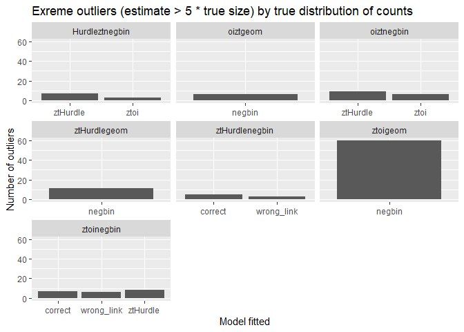
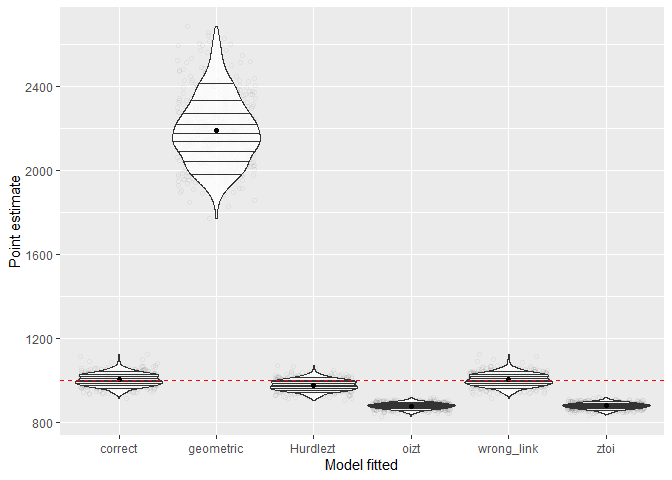
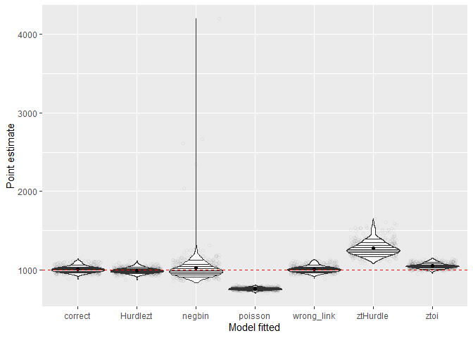
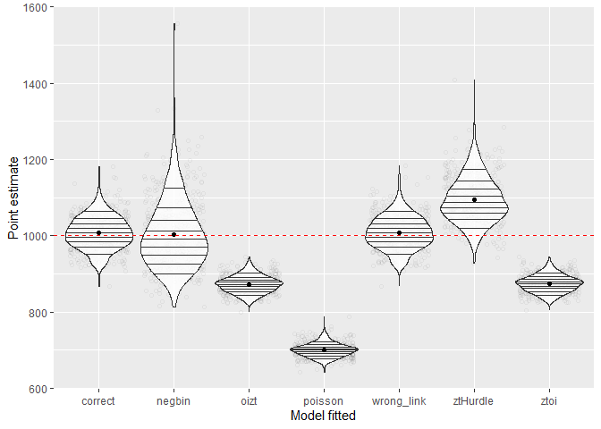
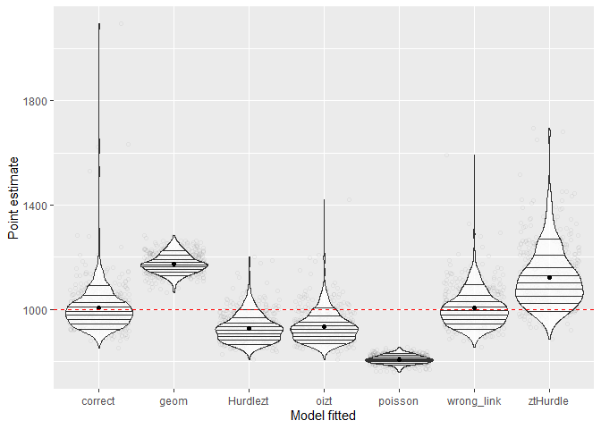
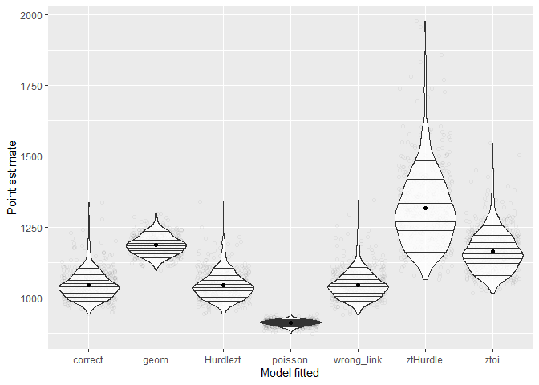
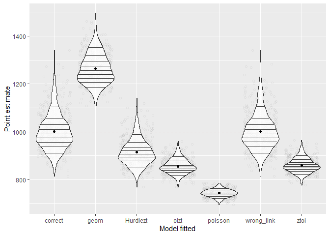
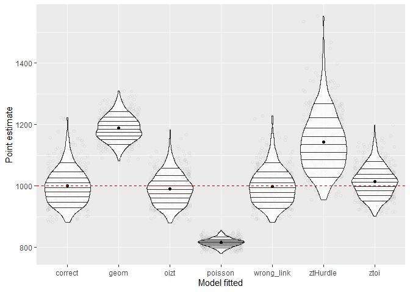
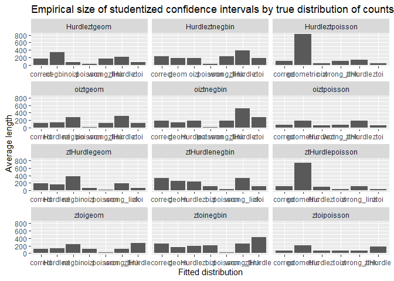

General results:


```r
summarised_df <- results_data_frame |> 
  group_by(data_generation, data_fitted) |> 
  summarise(mean_point              = mean(point, na.rm = TRUE),
            mean_ci_length_norm     = mean(conf_int_normal_upper - conf_int_normal_lower, na.rm = TRUE),
            coverage_ci_norm        = mean((conf_int_normal_lower < 1000) & (1000 < conf_int_normal_upper), na.rm = TRUE),
            mean_ci_length_log_norm = mean(conf_int_log_normal_upper - conf_int_log_normal_lower, na.rm = TRUE),
            coverage_ci_log_norm    = mean((conf_int_log_normal_lower < 1000) & (1000 < conf_int_log_normal_upper), na.rm = TRUE),
            succesful_fits          = mean(!is.na(point)))
```

```
## `summarise()` has grouped output by 'data_generation'. You can override using
## the `.groups` argument.
```

```r
print(summarised_df, n=20)
```

```
## # A tibble: 80 × 8
## # Groups:   data_generation [12]
##    data_generation data_fitted mean_point mean_ci_length_norm coverage_ci_norm
##    <chr>           <chr>            <dbl>               <dbl>            <dbl>
##  1 Hurdleztgeom    correct          1008.               168.             0.938
##  2 Hurdleztgeom    negbin           1003.               340.             0.927
##  3 Hurdleztgeom    oizt              873.                69.7            0    
##  4 Hurdleztgeom    poisson           700.                24.1            0    
##  5 Hurdleztgeom    wrong_link       1008.               168.             0.938
##  6 Hurdleztgeom    ztHurdle         1094.               220.             0.654
##  7 Hurdleztgeom    ztoi              874.                78.9            0    
##  8 Hurdleztnegbin  correct           999.               236.             0.914
##  9 Hurdleztnegbin  geom             1188.               181.             0.004
## 10 Hurdleztnegbin  oizt              990.               181.             0.864
## 11 Hurdleztnegbin  poisson           816.                22.2            0    
## 12 Hurdleztnegbin  wrong_link        999.               237.             0.918
## 13 Hurdleztnegbin  ztHurdle     23285419.          56970543.             0.934
## 14 Hurdleztnegbin  ztoi            64086.             34427.             0.908
## 15 Hurdleztpoisson correct          1002.               104.             0.964
## 16 Hurdleztpoisson geometric        2279.               820.             0    
## 17 Hurdleztpoisson oizt              908.                42.5            0    
## 18 Hurdleztpoisson wrong_link       1003.               103.             0.962
## 19 Hurdleztpoisson ztHurdle         1057.               140.             0.687
## 20 Hurdleztpoisson ztoi              908.                42.5            0    
## # ℹ 60 more rows
## # ℹ 3 more variables: mean_ci_length_log_norm <dbl>,
## #   coverage_ci_log_norm <dbl>, succesful_fits <dbl>
```

```r
pp <- summarised_df |>
  subset(succesful_fits < 1) |>
  as.data.frame() |> 
  mutate(data_generation = ordered(data_generation)) |>
  ggplot(aes(y = succesful_fits, x = data_fitted)) +
  geom_point() +
  facet_wrap(~data_generation, scales = c("free_x"), ncol = 3) + 
  ylab("Fitted proportion") +
  xlab("Model fitted") +
  ggtitle("Proportion of succesfully fitted models by true distribution of counts")

pp
```


Visualising outliers (i.e. when estimated regression parameters tend to boundary):


```r
outliers <- results_data_frame |>
  subset(!is.na(point)) |>
  subset(point > 5000) |> 
  group_by(data_generation, data_fitted) |>
  summarise(n = n()) |>
  ggplot(aes(x = data_fitted, weight = n)) +
  geom_bar() +
  facet_wrap(~ data_generation, scales = c("free_x")) + 
  ylab("Number of outliers") +
  xlab("Model fitted") +
  ggtitle("Exreme outliers (estimate > 5 * true size) by true distribution of counts")
```

```
## `summarise()` has grouped output by 'data_generation'. You can override using
## the `.groups` argument.
```

```r
outliers
```



## Point estimates

Results for counts generated by ztoipoisson:


```r
p1 <- results_data_frame |>
  subset(!is.na(point) & (data_generation == "ztoipoisson")) |>
  subset(point < 5000) |>
  ggplot(aes(x = data_fitted, y = point)) +
  geom_jitter(alpha = 0.05, shape = 1) + 
  geom_violin(alpha = 0.8, draw_quantiles = 1:9 / 10, scale = "width") +
  stat_summary(fun = function(x) mean(x, na.rm = TRUE), geom = "point") + 
  geom_hline(yintercept = 1000, linetype="dashed", color = "red") +
  ylab("Point estimate") +
  xlab("Model fitted")

p1
```


Summary statistics after excluding outliers:

```r
results_data_frame |>
  subset(!is.na(point) & (data_generation == "ztoipoisson")) |>
  subset(point < 5000) |>
  group_by(data_fitted) |>
  summarise(bias = mean(point - 1000),
            rel_bias = mean(point - 1000) / 1000,
            MSE = mean((point - 1000)^2),
            MAE = mean(abs(point - 1000)),
            coverage_normal = mean((conf_int_normal_lower < 1000) & (conf_int_normal_upper > 1000)),
            coverage_log_normal = mean((conf_int_log_normal_lower < 1000) & (conf_int_log_normal_upper > 1000))) |>
  print(n=20L)
```

```
## # A tibble: 6 × 7
##   data_fitted     bias rel_bias    MSE   MAE coverage_normal coverage_log_normal
##   <chr>          <dbl>    <dbl>  <dbl> <dbl>           <dbl>               <dbl>
## 1 Hurdlezt    -3.15e+1 -3.15e-2 1.29e3  32.2          0.465              0.599  
## 2 correct     -4.02e-2 -4.02e-5 3.09e2  13.9          0.938              0.938  
## 3 geometric    4.74e+2  4.74e-1 2.27e5 474.           0                  0      
## 4 oizt        -1.44e+1 -1.44e-2 6.17e2  20.3          0.829              0.876  
## 5 wrong_link  -4.12e-3 -4.12e-6 3.07e2  13.8          0.940              0.940  
## 6 ztHurdle     1.49e+2  1.49e-1 2.41e4 149.           0.0180             0.00802
```

Results for counts generated by oiztpoisson:


```r
p2 <- results_data_frame |>
  subset(!is.na(point) & (data_generation == "oiztpoisson")) |>
  subset(point < 5000) |>
  ggplot(aes(x = data_fitted, y = point)) +
  geom_jitter(alpha = 0.05, shape = 1) + 
  geom_violin(alpha = 0.8, draw_quantiles = 1:9 / 10, scale = "width") +
  stat_summary(fun = function(x) mean(x, na.rm = TRUE), geom = "point") + 
  geom_hline(yintercept = 1000, linetype="dashed", color = "red") +
  ylab("Point estimate") +
  xlab("Model fitted")

p2
```


Summary statistics after excluding outliers:

```r
results_data_frame |>
  subset(!is.na(point) & (data_generation == "oiztpoisson")) |>
  subset(point < 5000) |>
  group_by(data_fitted) |>
  summarise(bias = mean(point - 1000),
            rel_bias = mean(point - 1000) / 1000,
            MSE = mean((point - 1000)^2),
            MAE = mean(abs(point - 1000)),
            coverage_normal = mean((conf_int_normal_lower < 1000) & (conf_int_normal_upper > 1000)),
            coverage_log_normal = mean((conf_int_log_normal_lower < 1000) & (conf_int_log_normal_upper > 1000))) |>
  print(n=20L)
```

```
## # A tibble: 6 × 7
##   data_fitted    bias  rel_bias    MSE   MAE coverage_normal coverage_log_normal
##   <chr>         <dbl>     <dbl>  <dbl> <dbl>           <dbl>               <dbl>
## 1 Hurdlezt    -17.2   -0.0172   5.93e2  20.0           0.754               0.836
## 2 correct       0.382  0.000382 4.39e2  17.2           0.931               0.929
## 3 geometric   518.     0.518    2.70e5 518.            0                   0    
## 4 wrong_link    0.451  0.000451 4.31e2  16.9           0.923               0.927
## 5 ztHurdle    185.     0.185    3.63e4 185.            0                   0    
## 6 ztoi         21.0    0.0210   7.45e2  22.7           0.807               0.717
```

Results for counts generated by ztHurdlepoisson:


```r
p3 <- results_data_frame |>
  subset(!is.na(point) & (data_generation == "ztHurdlepoisson")) |>
  subset(point < 5000) |>
  ggplot(aes(x = data_fitted, y = point)) +
  geom_jitter(alpha = 0.05, shape = 1) + 
  geom_violin(alpha = 0.8, draw_quantiles = 1:9 / 10, scale = "width") +
  stat_summary(fun = function(x) mean(x, na.rm = TRUE), geom = "point") + 
  geom_hline(yintercept = 1000, linetype="dashed", color = "red") +
  ylab("Point estimate") +
  xlab("Model fitted")

p3
```



Summary statistics after excluding outliers:

```r
results_data_frame |>
  subset(!is.na(point) & (data_generation == "ztHurdlepoisson")) |>
  subset(point < 5000) |>
  group_by(data_fitted) |>
  summarise(bias = mean(point - 1000),
            rel_bias = mean(point - 1000) / 1000,
            MSE = mean((point - 1000)^2),
            MAE = mean(abs(point - 1000)),
            coverage_normal = mean((conf_int_normal_lower < 1000) & (conf_int_normal_upper > 1000)),
            coverage_log_normal = mean((conf_int_log_normal_lower < 1000) & (conf_int_log_normal_upper > 1000))) |>
  print(n=20L)
```

```
## # A tibble: 6 × 7
##   data_fitted    bias rel_bias    MSE    MAE coverage_normal coverage_log_normal
##   <chr>         <dbl>    <dbl>  <dbl>  <dbl>           <dbl>               <dbl>
## 1 Hurdlezt     -21.4  -0.0214  1.18e3   27.8           0.8                 0.87 
## 2 correct        3.88  0.00388 9.56e2   24.9           0.946               0.952
## 3 geometric   1191.    1.19    1.44e6 1191.            0                   0    
## 4 oizt        -121.   -0.121   1.49e4  121.            0                   0    
## 5 wrong_link     3.88  0.00388 9.56e2   24.9           0.946               0.952
## 6 ztoi        -121.   -0.121   1.48e4  121.            0                   0
```

Results for counts generated by hurdleztpoisson:


```r
p4 <- results_data_frame |>
  subset(!is.na(point) & (data_generation == "Hurdleztpoisson")) |>
  subset(point < 5000) |>
  ggplot(aes(x = data_fitted, y = point)) +
  geom_jitter(alpha = 0.05, shape = 1) + 
  geom_violin(alpha = 0.8, draw_quantiles = 1:9 / 10, scale = "width") +
  stat_summary(fun = function(x) mean(x, na.rm = TRUE), geom = "point") + 
  geom_hline(yintercept = 1000, linetype="dashed", color = "red") +
  ylab("Point estimate") +
  xlab("Model fitted")

p4
```


Summary statistics after excluding outliers:

```r
results_data_frame |>
  subset(!is.na(point) & (data_generation == "Hurdleztpoisson")) |>
  subset(point < 5000) |>
  group_by(data_fitted) |>
  summarise(bias = mean(point - 1000),
            rel_bias = mean(point - 1000) / 1000,
            MSE = mean((point - 1000)^2),
            MAE = mean(abs(point - 1000)),
            coverage_normal = mean((conf_int_normal_lower < 1000) & (conf_int_normal_upper > 1000)),
            coverage_log_normal = mean((conf_int_log_normal_lower < 1000) & (conf_int_log_normal_upper > 1000))) |>
  print(n=20L)
```

```
## # A tibble: 6 × 7
##   data_fitted    bias rel_bias    MSE    MAE coverage_normal coverage_log_normal
##   <chr>         <dbl>    <dbl>  <dbl>  <dbl>           <dbl>               <dbl>
## 1 correct        2.06  0.00206 6.48e2   20.1           0.964               0.958
## 2 geometric   1279.    1.28    1.67e6 1279.            0                   0    
## 3 oizt         -92.2  -0.0922  8.68e3   92.2           0                   0    
## 4 wrong_link     2.59  0.00259 6.47e2   20.0           0.962               0.954
## 5 ztHurdle      57.4   0.0574  4.49e3   58.3           0.687               0.553
## 6 ztoi         -91.8  -0.0918  8.59e3   91.8           0                   0
```

Results for counts generated by ztoigeom:


```r
p5 <- results_data_frame |>
  subset(!is.na(point) & (data_generation == "ztoigeom")) |>
  subset(point < 5000) |>
  ggplot(aes(x = data_fitted, y = point)) +
  geom_jitter(alpha = 0.05, shape = 1) + 
  geom_violin(alpha = 0.8, draw_quantiles = 1:9 / 10, scale = "width") +
  stat_summary(fun = function(x) mean(x, na.rm = TRUE), geom = "point") + 
  geom_hline(yintercept = 1000, linetype="dashed", color = "red") +
  ylab("Point estimate") +
  xlab("Model fitted")

p5
```


Summary statistics after excluding outliers:

```r
results_data_frame |>
  subset(!is.na(point) & (data_generation == "ztoigeom")) |>
  subset(point < 5000) |>
  group_by(data_fitted) |>
  summarise(bias = mean(point - 1000),
            rel_bias = mean(point - 1000) / 1000,
            MSE = mean((point - 1000)^2),
            MAE = mean(abs(point - 1000)),
            coverage_normal = mean((conf_int_normal_lower < 1000) & (conf_int_normal_upper > 1000)),
            coverage_log_normal = mean((conf_int_log_normal_lower < 1000) & (conf_int_log_normal_upper > 1000))) |>
  print(n=20L)
```

```
## # A tibble: 7 × 7
##   data_fitted    bias rel_bias    MSE   MAE coverage_normal coverage_log_normal
##   <chr>         <dbl>    <dbl>  <dbl> <dbl>           <dbl>               <dbl>
## 1 Hurdlezt     -34.8  -0.0348   2303.  40.2           0.774               0.822
## 2 correct        4.66  0.00466   975.  24.8           0.948               0.936
## 3 negbin        13.6   0.0136   6980.  59.9           0.868               0.861
## 4 oizt         -19.3  -0.0193   1683.  32.8           0.83                0.856
## 5 poisson     -255.   -0.255   65317. 255.            0                   0    
## 6 wrong_link     4.65  0.00465   983.  25.0           0.95                0.934
## 7 ztHurdle     200.    0.200   46338. 200.            0.13                0.068
```

Results for counts generated by oiztgeom:


```r
p6 <- results_data_frame |>
  subset(!is.na(point) & (data_generation == "oiztgeom")) |>
  subset(point < 5000) |>
  ggplot(aes(x = data_fitted, y = point)) +
  geom_jitter(alpha = 0.05, shape = 1) + 
  geom_violin(alpha = 0.8, draw_quantiles = 1:9 / 10, scale = "width") +
  stat_summary(fun = function(x) mean(x, na.rm = TRUE), geom = "point") + 
  geom_hline(yintercept = 1000, linetype="dashed", color = "red") +
  ylab("Point estimate") +
  xlab("Model fitted")

p6
```



Summary statistics after excluding outliers:

```r
results_data_frame |>
  subset(!is.na(point) & (data_generation == "oiztgeom")) |>
  subset(point < 5000) |>
  group_by(data_fitted) |>
  summarise(bias = mean(point - 1000),
            rel_bias = mean(point - 1000) / 1000,
            MSE = mean((point - 1000)^2),
            MAE = mean(abs(point - 1000)),
            coverage_normal = mean((conf_int_normal_lower < 1000) & (conf_int_normal_upper > 1000)),
            coverage_log_normal = mean((conf_int_log_normal_lower < 1000) & (conf_int_log_normal_upper > 1000))) |>
  print(n=20L)
```

```
## # A tibble: 7 × 7
##   data_fitted    bias rel_bias    MSE   MAE coverage_normal coverage_log_normal
##   <chr>         <dbl>    <dbl>  <dbl> <dbl>           <dbl>               <dbl>
## 1 Hurdlezt      -5.33 -0.00533  1133.  26.8           0.946               0.952
## 2 correct       10.4   0.0104   1675.  31.4           0.91                0.892
## 3 negbin        26.4   0.0264  43966.  80.5           0.850               0.844
## 4 poisson     -238.   -0.238   56943. 238.            0                   0    
## 5 wrong_link    10.5   0.0105   1685.  31.4           0.9                 0.89 
## 6 ztHurdle     278.    0.278   85606. 278.            0.004               0.004
## 7 ztoi          52.7   0.0527   3856.  53.5           0.702               0.608
```

Results for counts generated by ztHurdlegeom:


```r
p7 <- results_data_frame |>
  subset(!is.na(point) & (data_generation == "ztHurdlegeom")) |>
  subset(point < 5000) |>
  ggplot(aes(x = data_fitted, y = point)) +
  geom_jitter(alpha = 0.05, shape = 1) + 
  geom_violin(alpha = 0.8, draw_quantiles = 1:9 / 10, scale = "width") +
  stat_summary(fun = function(x) mean(x, na.rm = TRUE), geom = "point") + 
  geom_hline(yintercept = 1000, linetype="dashed", color = "red") +
  ylab("Point estimate") +
  xlab("Model fitted")

p7
```


Summary statistics after excluding outliers:

```r
results_data_frame |>
  subset(!is.na(point) & (data_generation == "ztHurdlegeom")) |>
  subset(point < 5000) |>
  group_by(data_fitted) |>
  summarise(bias = mean(point - 1000),
            rel_bias = mean(point - 1000) / 1000,
            MSE = mean((point - 1000)^2),
            MAE = mean(abs(point - 1000)),
            coverage_normal = mean((conf_int_normal_lower < 1000) & (conf_int_normal_upper > 1000)),
            coverage_log_normal = mean((conf_int_log_normal_lower < 1000) & (conf_int_log_normal_upper > 1000))) |>
  print(n=20L)
```

```
## # A tibble: 7 × 7
##   data_fitted    bias rel_bias     MSE   MAE coverage_normal coverage_log_normal
##   <chr>         <dbl>    <dbl>   <dbl> <dbl>           <dbl>               <dbl>
## 1 Hurdlezt     -30.9  -0.0309    2555.  42.4           0.86                0.892
## 2 correct        7.00  0.00700   2303.  35.8           0.96                0.956
## 3 negbin         5.04  0.00504  10385.  77.2           0.932               0.938
## 4 oizt        -188.   -0.188    35837. 188.            0                   0    
## 5 poisson     -330.   -0.330   109149. 330.            0                   0    
## 6 wrong_link    22.5   0.0225    6544.  38.3           0.962               0.958
## 7 ztoi        -188.   -0.188    35812. 188.            0                   0
```

Results for counts generated by hurdleztgeom:


```r
p8 <- results_data_frame |>
  subset(!is.na(point) & (data_generation == "Hurdleztgeom")) |>
  subset(point < 5000) |>
  ggplot(aes(x = data_fitted, y = point)) +
  geom_jitter(alpha = 0.05, shape = 1) + 
  geom_violin(alpha = 0.8, draw_quantiles = 1:9 / 10, scale = "width") +
  stat_summary(fun = function(x) mean(x, na.rm = TRUE), geom = "point") + 
  geom_hline(yintercept = 1000, linetype="dashed", color = "red") +
  ylab("Point estimate") +
  xlab("Model fitted")

p8
```



Summary statistics after excluding outliers:

```r
results_data_frame |>
  subset(!is.na(point) & (data_generation == "Hurdleztgeom")) |>
  subset(point < 5000) |>
  group_by(data_fitted) |>
  summarise(bias = mean(point - 1000),
            rel_bias = mean(point - 1000) / 1000,
            MSE = mean((point - 1000)^2),
            MAE = mean(abs(point - 1000)),
            coverage_normal = mean((conf_int_normal_lower < 1000) & (conf_int_normal_upper > 1000)),
            coverage_log_normal = mean((conf_int_log_normal_lower < 1000) & (conf_int_log_normal_upper > 1000))) |>
  print(n=20L)
```

```
## # A tibble: 7 × 7
##   data_fitted    bias rel_bias    MSE   MAE coverage_normal coverage_log_normal
##   <chr>         <dbl>    <dbl>  <dbl> <dbl>           <dbl>               <dbl>
## 1 correct        8.44  0.00844  1931.  34.7           0.938               0.944
## 2 negbin         3.36  0.00336  7995.  68.9           0.927               0.960
## 3 oizt        -127.   -0.127   16755. 127.            0                   0    
## 4 poisson     -300.   -0.300   90320. 300.            0                   0    
## 5 wrong_link     8.44  0.00844  1938.  34.8           0.938               0.944
## 6 ztHurdle      94.1   0.0941  12496.  95.8           0.654               0.542
## 7 ztoi        -126.   -0.126   16379. 126.            0                   0
```

Results for counts generated by ztoinegbin:


```r
p9 <- results_data_frame |>
  subset(!is.na(point) & (data_generation == "ztoinegbin")) |>
  subset(point < 5000) |>
  ggplot(aes(x = data_fitted, y = point)) +
  geom_jitter(alpha = 0.05, shape = 1) + 
  geom_violin(alpha = 0.8, draw_quantiles = 1:9 / 10, scale = "width") +
  stat_summary(fun = function(x) mean(x, na.rm = TRUE), geom = "point") + 
  geom_hline(yintercept = 1000, linetype="dashed", color = "red") +
  ylab("Point estimate") +
  xlab("Model fitted")

p9
```



Summary statistics after excluding outliers:

```r
results_data_frame |>
  subset(!is.na(point) & (data_generation == "ztoinegbin")) |>
  subset(point < 5000) |>
  group_by(data_fitted) |>
  summarise(bias = mean(point - 1000),
            rel_bias = mean(point - 1000) / 1000,
            MSE = mean((point - 1000)^2),
            MAE = mean(abs(point - 1000)),
            coverage_normal = mean((conf_int_normal_lower < 1000) & (conf_int_normal_upper > 1000)),
            coverage_log_normal = mean((conf_int_log_normal_lower < 1000) & (conf_int_log_normal_upper > 1000))) |>
  print(n=20L)
```

```
## # A tibble: 7 × 7
##   data_fitted    bias rel_bias    MSE   MAE coverage_normal coverage_log_normal
##   <chr>         <dbl>    <dbl>  <dbl> <dbl>           <dbl>               <dbl>
## 1 Hurdlezt     -71.2  -0.0712   8058.  79.7           0.55                0.682
## 2 correct        7.51  0.00751  8753.  55.6           0.921               0.945
## 3 geom         175.    0.175   32023. 175.            0                   0    
## 4 oizt         -66.5  -0.0665   8089.  78.4           0.58                0.702
## 5 poisson     -191.   -0.191   36847. 191.            0                   0    
## 6 wrong_link     5.02  0.00502  5245.  52.6           0.925               0.951
## 7 ztHurdle     122.    0.122   27929. 127.            0.986               0.768
```

Results for counts generated by oiztnegbin:


```r
p10 <- results_data_frame |>
  subset(!is.na(point) & (data_generation == "oiztnegbin")) |>
  subset(point < 5000) |>
  ggplot(aes(x = data_fitted, y = point)) +
  geom_jitter(alpha = 0.05, shape = 1) + 
  geom_violin(alpha = 0.8, draw_quantiles = 1:9 / 10, scale = "width") +
  stat_summary(fun = function(x) mean(x, na.rm = TRUE), geom = "point") + 
  geom_hline(yintercept = 1000, linetype="dashed", color = "red") +
  ylab("Point estimate") +
  xlab("Model fitted")

p10
```



Summary statistics after excluding outliers:

```r
results_data_frame |>
  subset(!is.na(point) & (data_generation == "oiztnegbin")) |>
  subset(point < 5000) |>
  group_by(data_fitted) |>
  summarise(bias = mean(point - 1000),
            rel_bias = mean(point - 1000) / 1000,
            MSE = mean((point - 1000)^2),
            MAE = mean(abs(point - 1000)),
            coverage_normal = mean((conf_int_normal_lower < 1000) & (conf_int_normal_upper > 1000)),
            coverage_log_normal = mean((conf_int_log_normal_lower < 1000) & (conf_int_log_normal_upper > 1000))) |>
  print(n=20L)
```

```
## # A tibble: 7 × 7
##   data_fitted  bias rel_bias     MSE   MAE coverage_normal coverage_log_normal
##   <chr>       <dbl>    <dbl>   <dbl> <dbl>           <dbl>               <dbl>
## 1 Hurdlezt     44.6   0.0446   4401.  49.8          0.99               0.844  
## 2 correct      45.7   0.0457   4533.  50.7          0.986              0.832  
## 3 geom        187.    0.187   36204. 187.           0                  0      
## 4 poisson     -87.4  -0.0874   7759.  87.4          0                  0      
## 5 wrong_link   47.2   0.0472   4828.  52.0          0.988              0.832  
## 6 ztHurdle    319.    0.319  119663. 319.           0.0387             0.00407
## 7 ztoi        166.    0.166   32982. 166.           0.229              0.0466
```

Results for counts generated by ztHurdlenegbin:


```r
p11 <- results_data_frame |>
  subset(!is.na(point) & (data_generation == "ztHurdlenegbin")) |>
  subset(point < 5000) |>
  ggplot(aes(x = data_fitted, y = point)) +
  geom_jitter(alpha = 0.05, shape = 1) + 
  geom_violin(alpha = 0.8, draw_quantiles = 1:9 / 10, scale = "width") +
  stat_summary(fun = function(x) mean(x, na.rm = TRUE), geom = "point") + 
  geom_hline(yintercept = 1000, linetype="dashed", color = "red") +
  ylab("Point estimate") +
  xlab("Model fitted")

p11
```



Summary statistics after excluding outliers:

```r
results_data_frame |>
  subset(!is.na(point) & (data_generation == "ztHurdlenegbin")) |>
  subset(point < 5000) |>
  group_by(data_fitted) |>
  summarise(bias = mean(point - 1000),
            rel_bias = mean(point - 1000) / 1000,
            MSE = mean((point - 1000)^2),
            MAE = mean(abs(point - 1000)),
            coverage_normal = mean((conf_int_normal_lower < 1000) & (conf_int_normal_upper > 1000)),
            coverage_log_normal = mean((conf_int_log_normal_lower < 1000) & (conf_int_log_normal_upper > 1000))) |>
  print(n=20L)
```

```
## # A tibble: 7 × 7
##   data_fitted    bias rel_bias    MSE   MAE coverage_normal coverage_log_normal
##   <chr>         <dbl>    <dbl>  <dbl> <dbl>           <dbl>               <dbl>
## 1 Hurdlezt     -85.5  -0.0855  10377.  91.6          0.576               0.752 
## 2 correct        1.45  0.00145  6035.  59.3          0.941               0.966 
## 3 geom         264.    0.264   73747. 264.           0                   0     
## 4 oizt        -144.   -0.144   21674. 144.           0.012               0.04  
## 5 poisson     -257.   -0.257   66139. 257.           0                   0     
## 6 wrong_link     2.21  0.00221  6133.  59.7          0.942               0.966 
## 7 ztoi        -141.   -0.141   20669. 141.           0.0160              0.0341
```

Results for counts generated by hurdleztnegbin:


```r
p12 <- results_data_frame |>
  subset(!is.na(point) & (data_generation == "Hurdleztnegbin")) |>
  subset(point < 5000) |>
  ggplot(aes(x = data_fitted, y = point)) +
  geom_jitter(alpha = 0.05, shape = 1) + 
  geom_violin(alpha = 0.8, draw_quantiles = 1:9 / 10, scale = "width") +
  stat_summary(fun = function(x) mean(x, na.rm = TRUE), geom = "point") + 
  geom_hline(yintercept = 1000, linetype="dashed", color = "red") +
  ylab("Point estimate") +
  xlab("Model fitted")

p12
```



Summary statistics after excluding outliers:

```r
results_data_frame |>
  subset(!is.na(point) & (data_generation == "Hurdleztnegbin")) |>
  subset(point < 5000) |>
  group_by(data_fitted) |>
  summarise(bias = mean(point - 1000),
            rel_bias = mean(point - 1000) / 1000,
            MSE = mean((point - 1000)^2),
            MAE = mean(abs(point - 1000)),
            coverage_normal = mean((conf_int_normal_lower < 1000) & (conf_int_normal_upper > 1000)),
            coverage_log_normal = mean((conf_int_log_normal_lower < 1000) & (conf_int_log_normal_upper > 1000))) |>
  print(n=20L)
```

```
## # A tibble: 7 × 7
##   data_fitted     bias rel_bias    MSE   MAE coverage_normal coverage_log_normal
##   <chr>          <dbl>    <dbl>  <dbl> <dbl>           <dbl>               <dbl>
## 1 correct       -0.693 -6.93e-4  3377.  45.9           0.914               0.948
## 2 geom         188.     1.88e-1 36842. 188.            0.004               0.002
## 3 oizt          -9.67  -9.67e-3  2653.  41.4           0.864               0.902
## 4 poisson     -184.    -1.84e-1 34097. 184.            0                   0    
## 5 wrong_link    -1.04  -1.04e-3  3402.  46.2           0.918               0.948
## 6 ztHurdle     143.     1.43e-1 29588. 145.            0.945               0.549
## 7 ztoi          13.7    1.37e-2  2637.  40.4           0.913               0.901
```


## Confidence intervals

### Normal

Exact binomial tests for coverage of lognormal confindence intervals with $H_0:p=0.95, H_1:p\neq0.95$:


```r
dd <- results_data_frame |>
  subset(!is.na(point)) |>
  subset(point < 5000) |>
  mutate(covr_norm = (conf_int_normal_lower < 1000) & (conf_int_normal_upper > 1000),
         covr_log  = (conf_int_log_normal_lower < 1000) & (conf_int_log_normal_upper > 1000)) |>
  group_by(data_generation, data_fitted) |>
  summarise(n = n(),
            mean = mean(covr_norm, na.rm = TRUE))
```

```
## `summarise()` has grouped output by 'data_generation'. You can override using
## the `.groups` argument.
```

```r
dd <- cbind(dd, p_value = NA, lower = NA, upper = NA, signif = NA)

for (x in 1:NROW(dd)) {
  jj <- binom.test(x = as.numeric(dd[x, 4]) * as.integer(dd[x, 3]), n = as.integer(dd[x, 3]), p = .95)
  # this jj object has some very weird interactions with the rest of R ecosystem
  dd[x, 5] <- jj$p.value |> as.numeric()
  dd[x, 6] <- jj[[4]][1]
  dd[x, 7] <- jj[[4]][2]
  dd[x, 8] <- ifelse(dd[x, 5] < .001, "***", ifelse(dd[x, 5] < .01, "**", ifelse(dd[x, 5] < .05, "*", ifelse(dd[x, 5] < .1, ".", ""))))
}

dd |> 
  mutate(p_value = round(p_value, digits = 4),
         lower   = round(lower, digits = 4),
         upper   = round(upper, digits = 4)) |>
  print(n = NROW(dd))
```

```
## # A tibble: 80 × 8
## # Groups:   data_generation [12]
##    data_generation data_fitted     n   mean p_value  lower  upper signif
##    <chr>           <chr>       <int>  <dbl>   <dbl>  <dbl>  <dbl> <chr> 
##  1 Hurdleztgeom    correct       500 0.938   0.217  0.913  0.958  ""    
##  2 Hurdleztgeom    negbin        494 0.927   0.0292 0.900  0.948  "*"   
##  3 Hurdleztgeom    oizt          500 0       0      0      0.0074 "***" 
##  4 Hurdleztgeom    poisson       490 0       0      0      0.0075 "***" 
##  5 Hurdleztgeom    wrong_link    500 0.938   0.217  0.913  0.958  ""    
##  6 Hurdleztgeom    ztHurdle      500 0.654   0      0.610  0.696  "***" 
##  7 Hurdleztgeom    ztoi          500 0       0      0      0.0074 "***" 
##  8 Hurdleztnegbin  correct       500 0.914   0.0006 0.886  0.937  "***" 
##  9 Hurdleztnegbin  geom          500 0.004   0      0.0005 0.0144 "***" 
## 10 Hurdleztnegbin  oizt          500 0.864   0      0.831  0.893  "***" 
## 11 Hurdleztnegbin  poisson       500 0       0      0      0.0074 "***" 
## 12 Hurdleztnegbin  wrong_link    500 0.918   0.002  0.890  0.940  "**"  
## 13 Hurdleztnegbin  ztHurdle      492 0.945   0.604  0.921  0.964  ""    
## 14 Hurdleztnegbin  ztoi          497 0.913   0.0006 0.885  0.937  "***" 
## 15 Hurdleztpoisson correct       499 0.964   0.181  0.944  0.978  ""    
## 16 Hurdleztpoisson geometric     500 0       0      0      0.0074 "***" 
## 17 Hurdleztpoisson oizt          497 0       0      0      0.0074 "***" 
## 18 Hurdleztpoisson wrong_link    499 0.962   0.258  0.941  0.977  ""    
## 19 Hurdleztpoisson ztHurdle      499 0.687   0      0.645  0.728  "***" 
## 20 Hurdleztpoisson ztoi          497 0       0      0      0.0074 "***" 
## 21 oiztgeom        Hurdlezt      500 0.946   0.681  0.922  0.964  ""    
## 22 oiztgeom        correct       500 0.91    0.0002 0.881  0.934  "***" 
## 23 oiztgeom        negbin        494 0.850   0      0.816  0.880  "***" 
## 24 oiztgeom        poisson       491 0       0      0      0.0075 "***" 
## 25 oiztgeom        wrong_link    500 0.9     0      0.870  0.925  "***" 
## 26 oiztgeom        ztHurdle      500 0.004   0      0.0005 0.0144 "***" 
## 27 oiztgeom        ztoi          500 0.702   0      0.660  0.742  "***" 
## 28 oiztnegbin      Hurdlezt      500 0.99    0      0.977  0.997  "***" 
## 29 oiztnegbin      correct       500 0.986   0      0.971  0.994  "***" 
## 30 oiztnegbin      geom          500 0       0      0      0.0074 "***" 
## 31 oiztnegbin      poisson       499 0       0      0      0.0074 "***" 
## 32 oiztnegbin      wrong_link    500 0.988   0      0.974  0.996  "***" 
## 33 oiztnegbin      ztHurdle      491 0.0387  0      0.0235 0.0598 "***" 
## 34 oiztnegbin      ztoi          494 0.229   0      0.192  0.268  "***" 
## 35 oiztpoisson     Hurdlezt      499 0.754   0      0.713  0.791  "***" 
## 36 oiztpoisson     correct       495 0.931   0.0627 0.905  0.952  "."   
## 37 oiztpoisson     geometric     500 0       0      0      0.0074 "***" 
## 38 oiztpoisson     wrong_link    493 0.923   0.0093 0.896  0.945  "**"  
## 39 oiztpoisson     ztHurdle      499 0       0      0      0.0074 "***" 
## 40 oiztpoisson     ztoi          498 0.807   0      0.770  0.841  "***" 
## 41 ztHurdlegeom    Hurdlezt      500 0.86    0      0.826  0.889  "***" 
## 42 ztHurdlegeom    correct       500 0.96    0.355  0.939  0.975  ""    
## 43 ztHurdlegeom    negbin        486 0.932   0.0761 0.906  0.953  "."   
## 44 ztHurdlegeom    oizt          500 0       0      0      0.0074 "***" 
## 45 ztHurdlegeom    poisson       500 0       0      0      0.0074 "***" 
## 46 ztHurdlegeom    wrong_link    495 0.962   0.301  0.941  0.977  ""    
## 47 ztHurdlegeom    ztoi          500 0       0      0      0.0074 "***" 
## 48 ztHurdlenegbin  Hurdlezt      500 0.576   0      0.531  0.620  "***" 
## 49 ztHurdlenegbin  correct       495 0.941   0.354  0.917  0.960  ""    
## 50 ztHurdlenegbin  geom          500 0       0      0      0.0074 "***" 
## 51 ztHurdlenegbin  oizt          500 0.012   0      0.0044 0.0259 "***" 
## 52 ztHurdlenegbin  poisson       500 0       0      0      0.0074 "***" 
## 53 ztHurdlenegbin  wrong_link    497 0.942   0.409  0.917  0.961  ""    
## 54 ztHurdlenegbin  ztoi          499 0.0160  0      0.0069 0.0313 "***" 
## 55 ztHurdlepoisson Hurdlezt      500 0.8     0      0.762  0.834  "***" 
## 56 ztHurdlepoisson correct       500 0.946   0.681  0.922  0.964  ""    
## 57 ztHurdlepoisson geometric     500 0       0      0      0.0074 "***" 
## 58 ztHurdlepoisson oizt          499 0       0      0      0.0074 "***" 
## 59 ztHurdlepoisson wrong_link    500 0.946   0.681  0.922  0.964  ""    
## 60 ztHurdlepoisson ztoi          498 0       0      0      0.0074 "***" 
## 61 ztoigeom        Hurdlezt      500 0.774   0      0.735  0.810  "***" 
## 62 ztoigeom        correct       500 0.948   0.837  0.925  0.966  ""    
## 63 ztoigeom        negbin        440 0.868   0      0.833  0.898  "***" 
## 64 ztoigeom        oizt          500 0.83    0      0.794  0.862  "***" 
## 65 ztoigeom        poisson       497 0       0      0      0.0074 "***" 
## 66 ztoigeom        wrong_link    500 0.95    1      0.927  0.967  ""    
## 67 ztoigeom        ztHurdle      500 0.13    0      0.102  0.163  "***" 
## 68 ztoinegbin      Hurdlezt      500 0.55    0      0.505  0.594  "***" 
## 69 ztoinegbin      correct       493 0.921   0.0051 0.893  0.943  "**"  
## 70 ztoinegbin      geom          500 0       0      0      0.0074 "***" 
## 71 ztoinegbin      oizt          500 0.58    0      0.535  0.624  "***" 
## 72 ztoinegbin      poisson       500 0       0      0      0.0074 "***" 
## 73 ztoinegbin      wrong_link    494 0.925   0.0169 0.898  0.947  "*"   
## 74 ztoinegbin      ztHurdle      491 0.986   0      0.971  0.994  "***" 
## 75 ztoipoisson     Hurdlezt      499 0.465   0      0.420  0.510  "***" 
## 76 ztoipoisson     correct       496 0.938   0.215  0.912  0.957  ""    
## 77 ztoipoisson     geometric     500 0       0      0      0.0074 "***" 
## 78 ztoipoisson     oizt          490 0.829   0      0.792  0.861  "***" 
## 79 ztoipoisson     wrong_link    497 0.940   0.302  0.915  0.959  ""    
## 80 ztoipoisson     ztHurdle      499 0.0180  0      0.0083 0.034  "***"
```

```r
## show only those that have high p value or have better coverage
dd |>
  filter(p_value > .05 | mean > .95) |>
  mutate(p_value = round(p_value, digits = 4),
         lower   = round(lower, digits = 4),
         upper   = round(upper, digits = 4)) |>
  print(n = NROW(dd))
```

```
## # A tibble: 22 × 8
## # Groups:   data_generation [12]
##    data_generation data_fitted     n  mean p_value lower upper signif
##    <chr>           <chr>       <int> <dbl>   <dbl> <dbl> <dbl> <chr> 
##  1 Hurdleztgeom    correct       500 0.938  0.217  0.913 0.958 ""    
##  2 Hurdleztgeom    wrong_link    500 0.938  0.217  0.913 0.958 ""    
##  3 Hurdleztnegbin  ztHurdle      492 0.945  0.604  0.921 0.964 ""    
##  4 Hurdleztpoisson correct       499 0.964  0.181  0.944 0.978 ""    
##  5 Hurdleztpoisson wrong_link    499 0.962  0.258  0.941 0.977 ""    
##  6 oiztgeom        Hurdlezt      500 0.946  0.681  0.922 0.964 ""    
##  7 oiztnegbin      Hurdlezt      500 0.99   0      0.977 0.997 "***" 
##  8 oiztnegbin      correct       500 0.986  0      0.971 0.994 "***" 
##  9 oiztnegbin      wrong_link    500 0.988  0      0.974 0.996 "***" 
## 10 oiztpoisson     correct       495 0.931  0.0627 0.905 0.952 "."   
## 11 ztHurdlegeom    correct       500 0.96   0.355  0.939 0.975 ""    
## 12 ztHurdlegeom    negbin        486 0.932  0.0761 0.906 0.953 "."   
## 13 ztHurdlegeom    wrong_link    495 0.962  0.301  0.941 0.977 ""    
## 14 ztHurdlenegbin  correct       495 0.941  0.354  0.917 0.960 ""    
## 15 ztHurdlenegbin  wrong_link    497 0.942  0.409  0.917 0.961 ""    
## 16 ztHurdlepoisson correct       500 0.946  0.681  0.922 0.964 ""    
## 17 ztHurdlepoisson wrong_link    500 0.946  0.681  0.922 0.964 ""    
## 18 ztoigeom        correct       500 0.948  0.837  0.925 0.966 ""    
## 19 ztoigeom        wrong_link    500 0.95   1      0.927 0.967 ""    
## 20 ztoinegbin      ztHurdle      491 0.986  0      0.971 0.994 "***" 
## 21 ztoipoisson     correct       496 0.938  0.215  0.912 0.957 ""    
## 22 ztoipoisson     wrong_link    497 0.940  0.302  0.915 0.959 ""
```

Visual results with confidence intervals:


```r
qq1 <- dd |>
  ggplot(aes(x = data_fitted)) +
  facet_wrap(~ data_generation, scales = c("free_x"), ncol = 3) +
  geom_point(aes(y = mean), colour = "navy", cex = 2) +
  geom_errorbar(aes(ymin = lower, ymax = upper), colour = "navy") +
  ggtitle("Empirical coverage of studentized confidence intervals by true distribution of counts") +
  xlab("Fitted distribution") +
  ylab("Coverage")

qq1
```


Average sizes of confidence intervals:


```r
qq2 <- results_data_frame |>
  subset(!is.na(point)) |>
  subset(point < 5000) |>
  group_by(data_generation, data_fitted) |>
  summarise(len = mean(conf_int_normal_upper - conf_int_normal_lower, na.rm = TRUE)) |>
  ggplot(aes(x = data_fitted, weight = len)) +
  geom_bar() +
  facet_wrap(~ data_generation, scales = c("free_x"), ncol = 3) +
  ylab("Average length") +
  xlab("Fitted distribution") +
  ggtitle("Empirical size of studentized confidence intervals by true distribution of counts")
```

```
## `summarise()` has grouped output by 'data_generation'. You can override using
## the `.groups` argument.
```

```r
qq2
```



### Logormal

Exact binomial tests for coverage of normal confindence intervals with $H_0:p=0.95, H_1:p\neq0.95$:


```r
dd <- results_data_frame |>
  subset(!is.na(point)) |>
  subset(point < 5000) |>
  mutate(covr_norm = (conf_int_normal_lower < 1000) & (conf_int_normal_upper > 1000),
         covr_log  = (conf_int_log_normal_lower < 1000) & (conf_int_log_normal_upper > 1000)) |>
  group_by(data_generation, data_fitted) |>
  summarise(n = n(),
            mean = mean(covr_log, na.rm = TRUE))
```

```
## `summarise()` has grouped output by 'data_generation'. You can override using
## the `.groups` argument.
```

```r
dd <- cbind(dd, p_value = NA, lower = NA, upper = NA, signif = NA)

for (x in 1:NROW(dd)) {
  jj <- binom.test(x = as.numeric(dd[x, 4]) * as.integer(dd[x, 3]), n = as.integer(dd[x, 3]), p = .95)
  # this jj object has some very weird interactions with the rest of R ecosystem
  dd[x, 5] <- jj$p.value |> as.numeric()
  dd[x, 6] <- jj[[4]][1]
  dd[x, 7] <- jj[[4]][2]
  dd[x, 8] <- ifelse(dd[x, 5] < .001, "***", ifelse(dd[x, 5] < .01, "**", ifelse(dd[x, 5] < .05, "*", ifelse(dd[x, 5] < .1, ".", ""))))
}

dd |> 
  mutate(p_value = round(p_value, digits = 4),
         lower   = round(lower, digits = 4),
         upper   = round(upper, digits = 4)) |>
  print(n = NROW(dd))
```

```
## # A tibble: 80 × 8
## # Groups:   data_generation [12]
##    data_generation data_fitted     n    mean p_value  lower  upper signif
##    <chr>           <chr>       <int>   <dbl>   <dbl>  <dbl>  <dbl> <chr> 
##  1 Hurdleztgeom    correct       500 0.944    0.537  0.920  0.962  ""    
##  2 Hurdleztgeom    negbin        494 0.960    0.408  0.938  0.975  ""    
##  3 Hurdleztgeom    oizt          500 0        0      0      0.0074 "***" 
##  4 Hurdleztgeom    poisson       490 0        0      0      0.0075 "***" 
##  5 Hurdleztgeom    wrong_link    500 0.944    0.537  0.920  0.962  ""    
##  6 Hurdleztgeom    ztHurdle      500 0.542    0      0.497  0.586  "***" 
##  7 Hurdleztgeom    ztoi          500 0        0      0      0.0074 "***" 
##  8 Hurdleztnegbin  correct       500 0.948    0.837  0.925  0.966  ""    
##  9 Hurdleztnegbin  geom          500 0.002    0      0.0001 0.0111 "***" 
## 10 Hurdleztnegbin  oizt          500 0.902    0      0.872  0.927  "***" 
## 11 Hurdleztnegbin  poisson       500 0        0      0      0.0074 "***" 
## 12 Hurdleztnegbin  wrong_link    500 0.948    0.837  0.925  0.966  ""    
## 13 Hurdleztnegbin  ztHurdle      492 0.549    0      0.504  0.593  "***" 
## 14 Hurdleztnegbin  ztoi          497 0.901    0      0.872  0.926  "***" 
## 15 Hurdleztpoisson correct       499 0.958    0.473  0.936  0.974  ""    
## 16 Hurdleztpoisson geometric     500 0        0      0      0.0074 "***" 
## 17 Hurdleztpoisson oizt          497 0        0      0      0.0074 "***" 
## 18 Hurdleztpoisson wrong_link    499 0.954    0.758  0.932  0.971  ""    
## 19 Hurdleztpoisson ztHurdle      499 0.553    0      0.508  0.597  "***" 
## 20 Hurdleztpoisson ztoi          497 0        0      0      0.0074 "***" 
## 21 oiztgeom        Hurdlezt      500 0.952    0.918  0.929  0.969  ""    
## 22 oiztgeom        correct       500 0.892    0      0.861  0.918  "***" 
## 23 oiztgeom        negbin        494 0.844    0      0.809  0.875  "***" 
## 24 oiztgeom        poisson       491 0        0      0      0.0075 "***" 
## 25 oiztgeom        wrong_link    500 0.89     0      0.859  0.916  "***" 
## 26 oiztgeom        ztHurdle      500 0.004    0      0.0005 0.0144 "***" 
## 27 oiztgeom        ztoi          500 0.608    0      0.564  0.651  "***" 
## 28 oiztnegbin      Hurdlezt      500 0.844    0      0.809  0.875  "***" 
## 29 oiztnegbin      correct       500 0.832    0      0.796  0.864  "***" 
## 30 oiztnegbin      geom          500 0        0      0      0.0074 "***" 
## 31 oiztnegbin      poisson       499 0        0      0      0.0074 "***" 
## 32 oiztnegbin      wrong_link    500 0.832    0      0.796  0.864  "***" 
## 33 oiztnegbin      ztHurdle      491 0.00407  0      0.0005 0.0146 "***" 
## 34 oiztnegbin      ztoi          494 0.0466   0      0.0297 0.069  "***" 
## 35 oiztpoisson     Hurdlezt      499 0.836    0      0.800  0.867  "***" 
## 36 oiztpoisson     correct       495 0.929    0.0389 0.903  0.950  "*"   
## 37 oiztpoisson     geometric     500 0        0      0      0.0074 "***" 
## 38 oiztpoisson     wrong_link    493 0.927    0.0229 0.900  0.948  "*"   
## 39 oiztpoisson     ztHurdle      499 0        0      0      0.0074 "***" 
## 40 oiztpoisson     ztoi          498 0.717    0      0.675  0.756  "***" 
## 41 ztHurdlegeom    Hurdlezt      500 0.892    0      0.861  0.918  "***" 
## 42 ztHurdlegeom    correct       500 0.956    0.608  0.934  0.972  ""    
## 43 ztHurdlegeom    negbin        486 0.938    0.251  0.913  0.958  ""    
## 44 ztHurdlegeom    oizt          500 0        0      0      0.0074 "***" 
## 45 ztHurdlegeom    poisson       500 0        0      0      0.0074 "***" 
## 46 ztHurdlegeom    wrong_link    495 0.958    0.535  0.936  0.974  ""    
## 47 ztHurdlegeom    ztoi          500 0        0      0      0.0074 "***" 
## 48 ztHurdlenegbin  Hurdlezt      500 0.752    0      0.712  0.789  "***" 
## 49 ztHurdlenegbin  correct       495 0.966    0.121  0.946  0.980  ""    
## 50 ztHurdlenegbin  geom          500 0        0      0      0.0074 "***" 
## 51 ztHurdlenegbin  oizt          500 0.04     0      0.0246 0.0611 "***" 
## 52 ztHurdlenegbin  poisson       500 0        0      0      0.0074 "***" 
## 53 ztHurdlenegbin  wrong_link    497 0.966    0.122  0.946  0.98   ""    
## 54 ztHurdlenegbin  ztoi          499 0.0341   0      0.02   0.054  "***" 
## 55 ztHurdlepoisson Hurdlezt      500 0.87     0      0.837  0.898  "***" 
## 56 ztHurdlepoisson correct       500 0.952    0.918  0.929  0.969  ""    
## 57 ztHurdlepoisson geometric     500 0        0      0      0.0074 "***" 
## 58 ztHurdlepoisson oizt          499 0        0      0      0.0074 "***" 
## 59 ztHurdlepoisson wrong_link    500 0.952    0.918  0.929  0.969  ""    
## 60 ztHurdlepoisson ztoi          498 0        0      0      0.0074 "***" 
## 61 ztoigeom        Hurdlezt      500 0.822    0      0.786  0.854  "***" 
## 62 ztoigeom        correct       500 0.936    0.150  0.911  0.956  ""    
## 63 ztoigeom        negbin        440 0.861    0      0.826  0.892  "***" 
## 64 ztoigeom        oizt          500 0.856    0      0.822  0.886  "***" 
## 65 ztoigeom        poisson       497 0        0      0      0.0074 "***" 
## 66 ztoigeom        wrong_link    500 0.934    0.101  0.909  0.954  ""    
## 67 ztoigeom        ztHurdle      500 0.068    0      0.0475 0.0937 "***" 
## 68 ztoinegbin      Hurdlezt      500 0.682    0      0.639  0.723  "***" 
## 69 ztoinegbin      correct       493 0.945    0.605  0.921  0.964  ""    
## 70 ztoinegbin      geom          500 0        0      0      0.0074 "***" 
## 71 ztoinegbin      oizt          500 0.702    0      0.660  0.742  "***" 
## 72 ztoinegbin      poisson       500 0        0      0      0.0074 "***" 
## 73 ztoinegbin      wrong_link    494 0.951    1      0.929  0.969  ""    
## 74 ztoinegbin      ztHurdle      491 0.768    0      0.728  0.804  "***" 
## 75 ztoipoisson     Hurdlezt      499 0.599    0      0.555  0.642  "***" 
## 76 ztoipoisson     correct       496 0.938    0.215  0.912  0.957  ""    
## 77 ztoipoisson     geometric     500 0        0      0      0.0074 "***" 
## 78 ztoipoisson     oizt          490 0.876    0      0.843  0.903  "***" 
## 79 ztoipoisson     wrong_link    497 0.940    0.302  0.915  0.959  ""    
## 80 ztoipoisson     ztHurdle      499 0.00802  0      0.0022 0.0204 "***"
```

```r
## show only those that have high p value or have better coverage
dd |>
  filter(p_value > .05 | mean > .95) |>
  mutate(p_value = round(p_value, digits = 4),
         lower   = round(lower, digits = 4),
         upper   = round(upper, digits = 4)) |>
  print(n = NROW(dd))
```

```
## # A tibble: 21 × 8
## # Groups:   data_generation [10]
##    data_generation data_fitted     n  mean p_value lower upper signif
##    <chr>           <chr>       <int> <dbl>   <dbl> <dbl> <dbl> <chr> 
##  1 Hurdleztgeom    correct       500 0.944   0.537 0.920 0.962 ""    
##  2 Hurdleztgeom    negbin        494 0.960   0.408 0.938 0.975 ""    
##  3 Hurdleztgeom    wrong_link    500 0.944   0.537 0.920 0.962 ""    
##  4 Hurdleztnegbin  correct       500 0.948   0.837 0.925 0.966 ""    
##  5 Hurdleztnegbin  wrong_link    500 0.948   0.837 0.925 0.966 ""    
##  6 Hurdleztpoisson correct       499 0.958   0.473 0.936 0.974 ""    
##  7 Hurdleztpoisson wrong_link    499 0.954   0.758 0.932 0.971 ""    
##  8 oiztgeom        Hurdlezt      500 0.952   0.918 0.929 0.969 ""    
##  9 ztHurdlegeom    correct       500 0.956   0.608 0.934 0.972 ""    
## 10 ztHurdlegeom    negbin        486 0.938   0.251 0.913 0.958 ""    
## 11 ztHurdlegeom    wrong_link    495 0.958   0.535 0.936 0.974 ""    
## 12 ztHurdlenegbin  correct       495 0.966   0.121 0.946 0.980 ""    
## 13 ztHurdlenegbin  wrong_link    497 0.966   0.122 0.946 0.98  ""    
## 14 ztHurdlepoisson correct       500 0.952   0.918 0.929 0.969 ""    
## 15 ztHurdlepoisson wrong_link    500 0.952   0.918 0.929 0.969 ""    
## 16 ztoigeom        correct       500 0.936   0.150 0.911 0.956 ""    
## 17 ztoigeom        wrong_link    500 0.934   0.101 0.909 0.954 ""    
## 18 ztoinegbin      correct       493 0.945   0.605 0.921 0.964 ""    
## 19 ztoinegbin      wrong_link    494 0.951   1     0.929 0.969 ""    
## 20 ztoipoisson     correct       496 0.938   0.215 0.912 0.957 ""    
## 21 ztoipoisson     wrong_link    497 0.940   0.302 0.915 0.959 ""
```

Visual results with confidence intervals:


```r
qq3 <- dd |>
  ggplot(aes(x = data_fitted)) +
  facet_wrap(~ data_generation, scales = c("free_x"), ncol = 3) +
  geom_point(aes(y = mean), colour = "navy", cex = 2) +
  geom_errorbar(aes(ymin = lower, ymax = upper), colour = "navy") +
  ggtitle("Empirical coverage of log normal confidence intervals by true distribution of counts") +
  xlab("Fitted distribution") +
  ylab("Coverage")

qq3
```


Average sizes of confidence intervals:


```r
qq4 <- results_data_frame |>
  subset(!is.na(point)) |>
  subset(point < 5000) |>
  group_by(data_generation, data_fitted) |>
  summarise(len = mean(conf_int_log_normal_upper - conf_int_log_normal_lower, na.rm = TRUE)) |>
  ggplot(aes(x = data_fitted, weight = len)) +
  geom_bar() +
  facet_wrap(~ data_generation, scales = "free", ncol = 3) +
  ylab("Average length") +
  xlab("Fitted distribution") +
  ggtitle("Empirical size of log normal confidence intervals by true distribution of counts")
```

```
## `summarise()` has grouped output by 'data_generation'. You can override using
## the `.groups` argument.
```

```r
qq4
```


